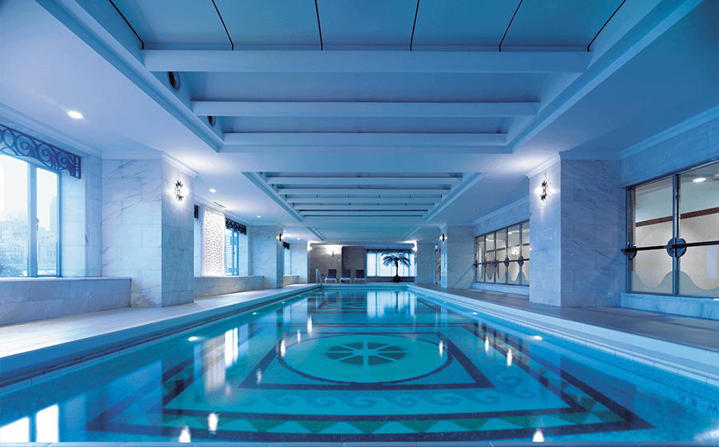
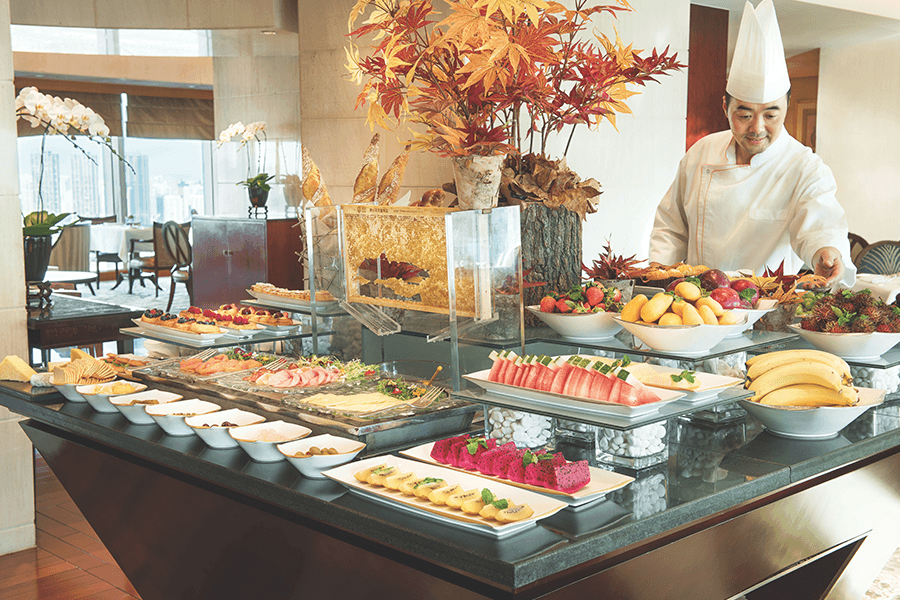
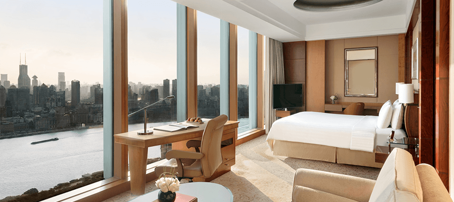
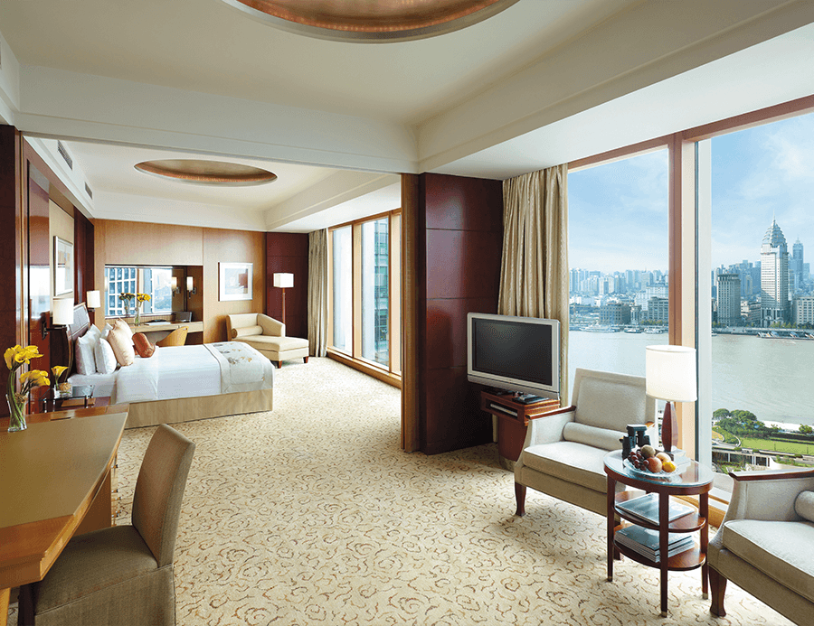
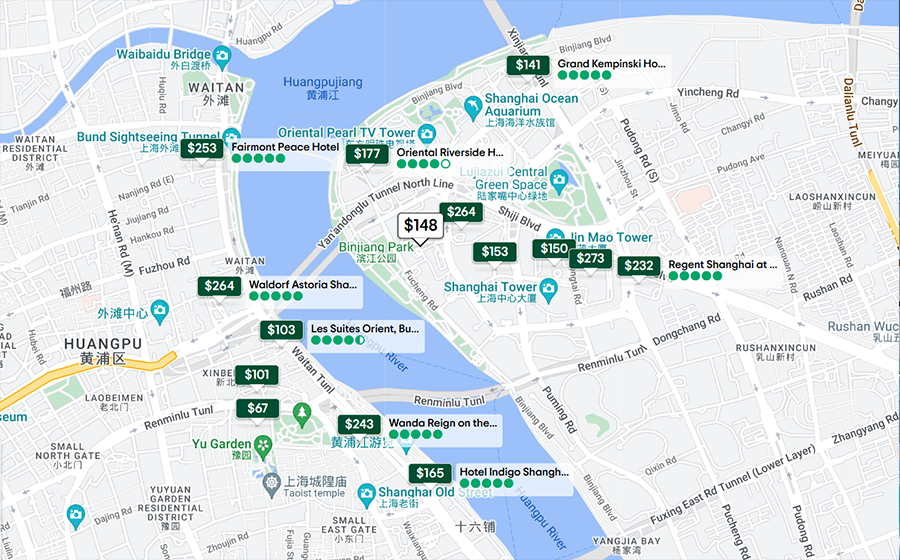

    <h1>Accommodations</h1>
    

        <strong style="color: black">IEEE VR 2024: the 31st IEEE Conference on Virtual Reality and 3D User Interfaces </strong>
         
        March 16-21, 2024 | Contemporary Resort, Walt Disney World, Orlando, Florida USA
         
    

    
    <h2>
       Contemporary Resort, Walt Disney World
    </h2>
    

        4600 North World Drive 
        Lake Buena Vista, Florida 32830-8413 
        Stars: 5 star
    

    

        As Shanghai's preeminent hotel, Pudong Shangri-La, Shanghai offers business and leisure travellers the perfect combination of comfort, service and convenience. Located on the Huangpu River in Shanghai's vibrant Lujiazui financial district, directly opposite the historic Bund, the hotel enjoys easy access to the city's most famous sites. Hongqiao International Airport (SHA) can be reached in just 35 minutes and Pudong International Airport (PVG） in 45 minutes by taxi. The hotel comprises a luxurious collection of well-appointed guestrooms and suites in two distinctive wings, and all rooms feature panoramic views of the Bund, the Huangpu River or Pudong's spectacular skyline.
    

    

        Website of Contemporary Resort, Walt Disney World: 
        <a href = "https://disneyworld.disney.go.com/resorts/contemporary-resort/">https://disneyworld.disney.go.com/resorts/contemporary-resort/</a>
    

    

        Book Pudong Shangri-La Hotel with the following link to receive the discount.
    

    

    <a href="http://www.shangri-la.com/reservations/booking/en/index.aspx?hid=SLPU&group_code=JEX250323&check_in=20240325&check_out=20240330" class="btn btn--primary" style="" target="_blank">Book the Hotel</a>
    

    

        Contact Ms. Shen if you have any questions about booking. 
        tel：021-28286383 
        email：olivia.shen@shangri-la.com 
    

    

        

            
            
        

        

            
            
        

        

            
            
        

    

    <h2>
        Other Nearby Hotels
    </h2>
    
    

        <strong style="color: black;text-decoration:underline">The Ritz-Carlton Shanghai, Pudong</strong> 
        <strong style="color: black">Address</strong>: 8 Century Avenue, Lujiazui, Pudong, 200120 Shanghai, China  
        <strong style="color: black">Distance from the conference venue</strong>: 250m 
        <strong style="color: black">Stars</strong>: 5 Star
    

    

        <strong style="color: black;text-decoration:underline">IFC Residence</strong> 
        <strong style="color: black">Address</strong>: No.8 Century Avenue, Pudong, 200120 Shanghai, China  
        <strong style="color: black">Distance from the conference venue</strong>: 530m 
        <strong style="color: black">Stars</strong>: 5 Star
    

    

        <strong>You can use a hotel booking site online.</strong> 
        From the link below, you can check the availability of accommodations around Pudong Shangri-La Hotel from 3/24 to 3/29 (check out on 3/30) 
        <a href = "https://www.booking.com/hotel/cn/pudong-shangri-la.html?aid=304142&label=gen173nr-1FCAEoggI46AdIM1gEaGKIAQGYARW4AQfIAQ3YAQHoAQH4AQuIAgGoAgO4AqG87p4GwAIB0gIkNWU0NGVjYmMtMmRjMy00ZmQxLThiM2YtYjY1ODA5Zjc5MmE52AIG4AIB&sid=64e80a742c14b42b6551aeb1a6c7f163&\atlas_src=sr_iw_btn%3Bcheckin%3D2024-03-25%3Bcheckout%3D2024-03-29%3Bdest_id%3D0%3Bdist%3D0%3Bgroup_adults%3D1%3Bgroup_children%3D0%3Bhighlighted_blocks%3D18142209_189756224_2_2_0%3Bno_rooms%3D1%3Broom1%3DA%3Bsb_price_type%3Dtotal%3Btype%3Dtotal%3Bucfs%3D1&lang=en-us&soz=1&lang_changed=1">booking.com
        </a> 
        <a href = "https://www.expedia.com/Shanghai-Hotels-Pudong-Shangri-La.h124595.Hotel-Information?chkin=2024-02-02&chkout=2024-02-08&x_pwa=1&rfrr=HSR&pwa_ts=1675337406837&referrerUrl=aHR0cHM6Ly93d3cuZXhwZWRpYS5jb20vSG90ZWwtU2VhcmNo&useRewards=false&rm1=a1&regionId=3145&destination=Shanghai%2C+China&destType=MARKET&neighborhoodId=6130137&selected=124595&sort=RECOMMENDED&top_dp=166&top_cur=USD&userIntent=&selectedRoomType=202151678&selectedRatePlan=222190788">expdeia.com
        </a>
    

