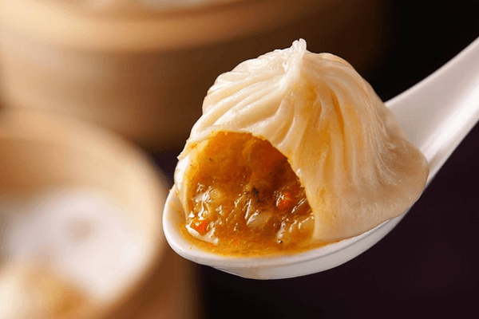
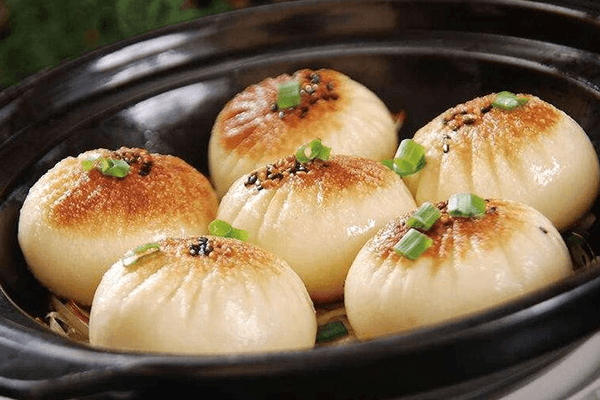
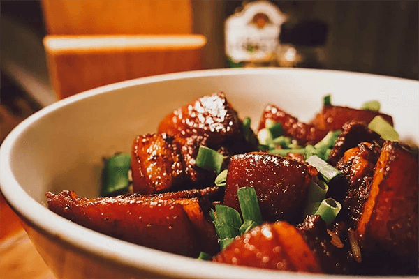
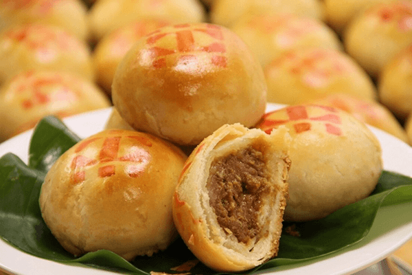
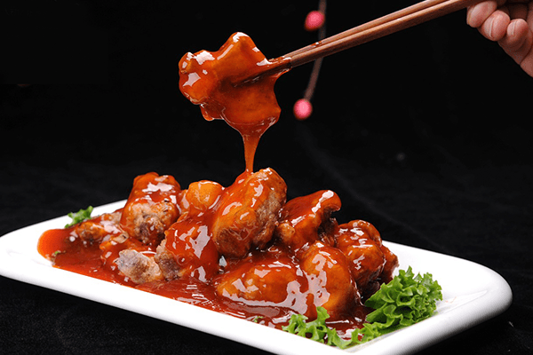
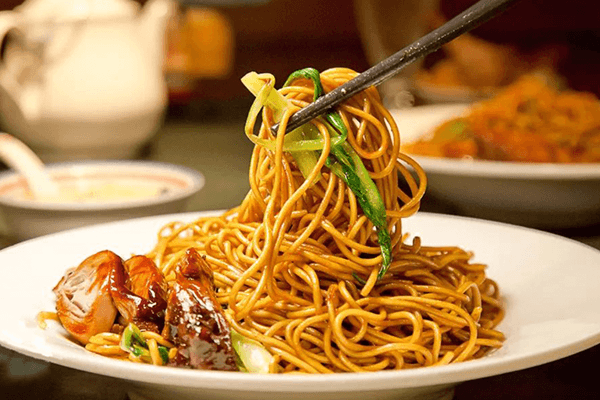

    <h1>Dining Out in Shanghai</h1>
    

        <strong style="color: black">IEEE VR 2023: the 30th IEEE Conference on Virtual Reality and 3D User Interfaces </strong>
         
        March 25-29, 2023, Shanghai, China
         
        <a href="https://ieeevr.org/2023/">https://ieeevr.org/2023/</a>
    

    <h2>1. Xiaolongbao</h2>
    
A type of steamed dumpling made with a thin skin of dough and stuffed with pork or minced crab meat, and soup. The delicious soup stays inside the dumpling until it is bitten.

    
    <h2>2. Shengjianbao</h2>
    
Shengjianbao is a round bun filled with pork, similar to a xiaolongbao but thicker due to the addition of yeast. It is pan-fried and topped with sesame seeds and chopped scallions for flavor.

    
    <h2>3. Shanghai-Style Braised Pork Belly(Hong Shao Rou)</h2>
    
Hong shao rou perfectly showcases the Shanghainese fondness for mixing savory or sour with blasts of sweet. Tender pork belly cubes are doused in a sweet and sticky sauce – a mixture of vinegar, soy, and sugar that come together in a vibrant red color, hence the Chinese character “hong” in the name. 

    
    <h2>4. Savory mooncakes</h2>
    
Mooncakes consumed in other parts of China are usually sweet, with fillings such as sesame seeds, walnuts, and red bean paste. However, in Shanghai, during the Mid-Autumn Festival, locals consume a savory version of mooncakes filled with meat. This type of mooncake is usually only available at select local restaurants.

    
    <h2>5. Sweet and sour spare ribs</h2>
    
The fresh pork ribs, which appear shiny and red after being cooked, are traditionally deep-fried and then coated in a sweet and sour sauce.

    
    <h2>6. Shanghai fried noodles</h2>
    
Shanghai fried noodles are fried thick noodles (sometimes udon) with soy sauce. It is most commonly cooked with bok choy and pork.

    
    <h2>Links</h2>
    <ul>
        <li><a href="https://www.willflyforfood.net/shanghai-food-guide/">Food in Shanghai</a></li>
        <li><a href="https://thetravelintern.com/china-shanghai-food-guide/">Shanghai Food Guide</a></li>
        <li><a href="https://www.cookly.me/magazine/asia/china/10-foods-you-must-try-in-shanghai/">10 Foods You Must Try in Shanghai</a></li>
        <li><a href="https://www.tripadvisor.com.sg/Restaurants-g308272-c11-Shanghai.html">Chinese Restaurants in Shanghai</a></li>
        <li><a href="https://www.tripadvisor.co.nz/Attractions-g308272-Activities-c20-Shanghai.html">Nightlife in Shanghai</a></li>
    </ul>

