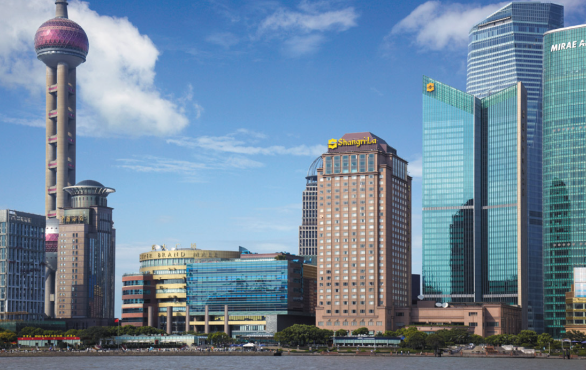
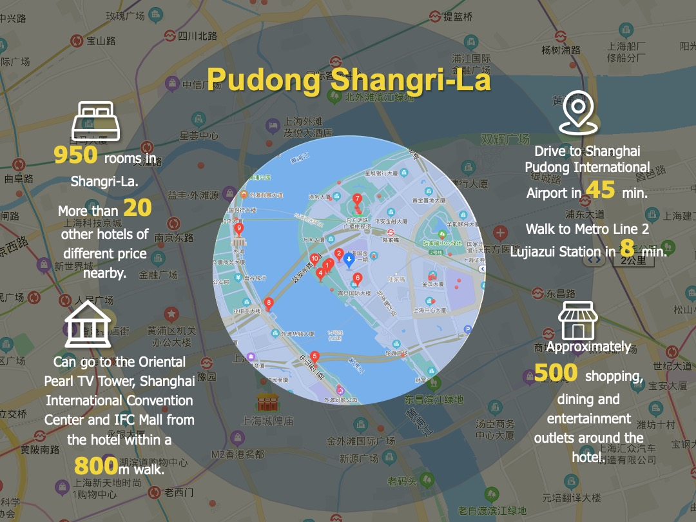
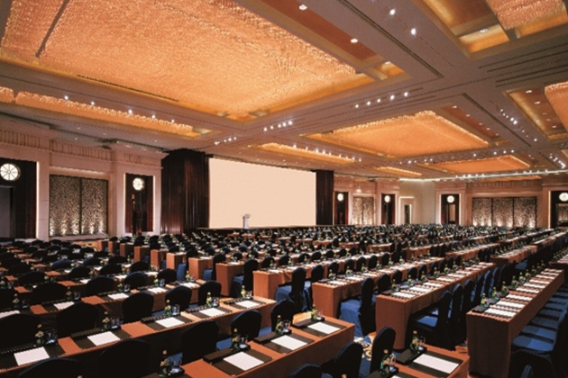
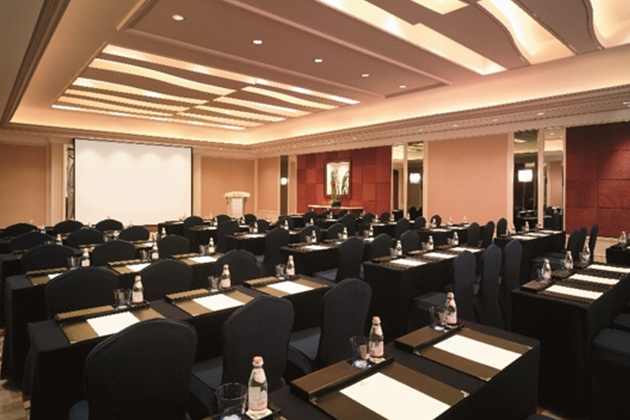
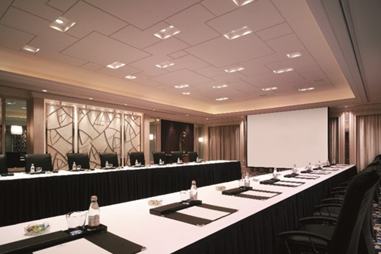
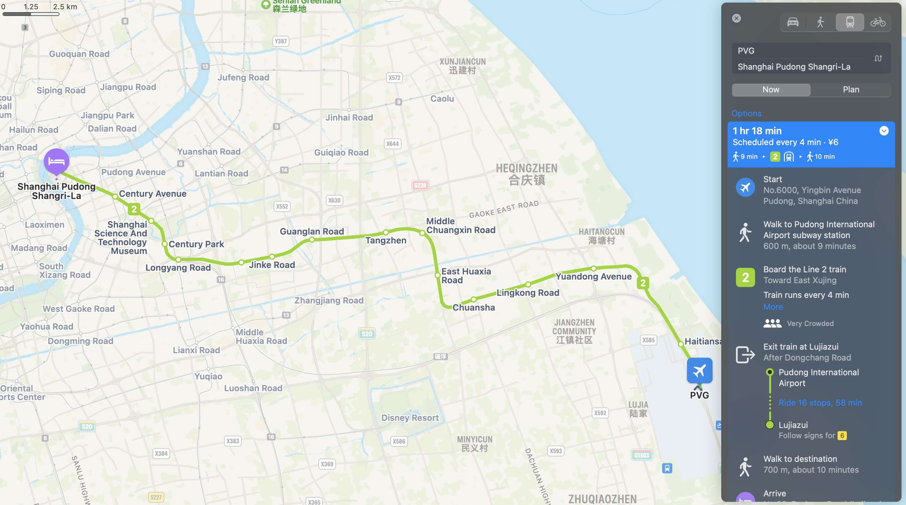
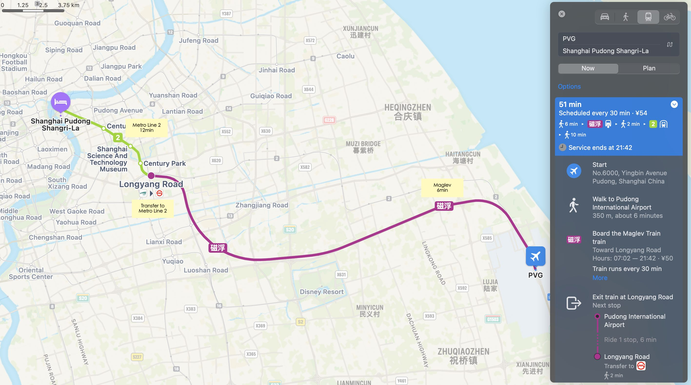
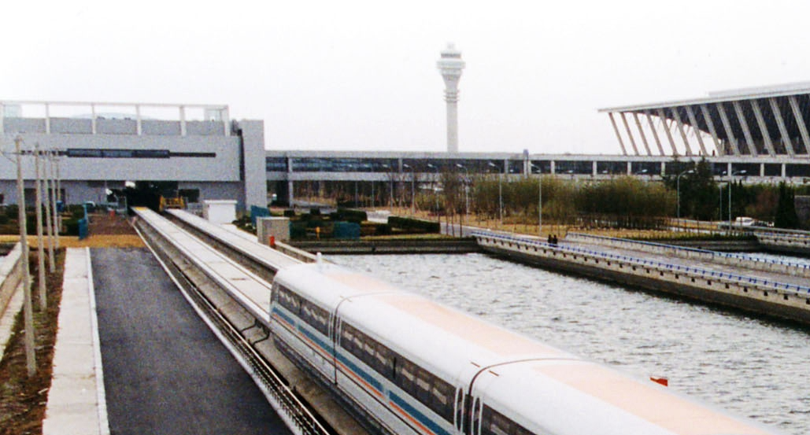
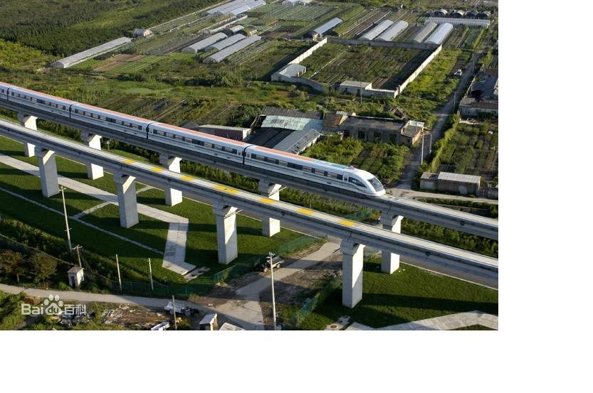
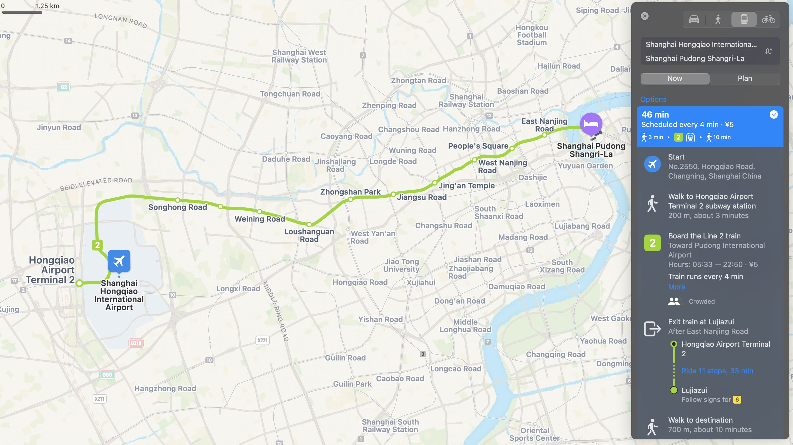

    <h1>Getting There</h1>
    

        <strong style="color: black">IEEE VR 2024: the 31st IEEE Conference on Virtual Reality and 3D User Interfaces </strong>
         
        March 16-21, 2024 | Contemporary Hotel, Walt Disney World, Orlando, Florida USA
         
        <a href="https://ieeevr.org/2024/">https://ieeevr.org/2024/</a>
    

    <h2>Conference Venue</h2>
    

        
        
    

    
IEEE VR 2024 will take place at the Contemporary Hotel, Walt Disney World, Orlando, Florida USA, from March 16th-21st, 2024.

    
The hotel’s grand room can accommodate 1500 people for meetings or banquets, and include 12 function rooms with professional audio-visual facilities.

    

        

            
            
        

        

            
            
        

    

    <h2>Directions to the Venue</h2>
    
Shanghai is a very well-connected city and you can get to our conference venue quickly, comfortably and cheaply. If you arrive in Shanghai by plane or train, we offer a variety of transportation suggestions below.

    <h3>1.Arriving by <strong>plane</strong> via <strong>Shanghai Pudong International Airport</strong></h3>
    

    <strong style="color:black">Option1: Metro</strong>
    <ol type="1" start="1">
        <li>Take <strong style="color:black">Metro Line 2</strong> directly to <strong style="color:black">Lujiazui Station</strong></li>
        <li>Leaving the <strong style="color:black">Lujiazui Station</strong> at Exit 6 and walking for about 8 minutes to Pudong Shangri-La.</li>
    </ol>
    It costs about 6 CNY and takes about 1 hour and 20 minutes.
     
    Line 2 runs every 4 minutes, with the first train departing at 6:00 and the last train at 22:30. 
    <a href="http://service.shmetro.com/en/hcskb/242.htm">http://service.shmetro.com/en/hcskb/242.htm</a>
    
    

     
    

    <strong style="color:black">Option2: Maglev+ Metro</strong>
    <ol type="1" start="1">
        <li>Take <strong style="color:black">Maglev</strong> to <strong style="color:black">Longyang Road</strong>.</li>
        <li>Then, take <strong style="color:black">Metro Line 2</strong> to <strong style="color:black">Lujiazui Station</strong>.</li>
        <li>Leaving the <strong style="color:black">Lujiazui Station</strong> at Exit 6 and walking for about 8 minutes to Pudong Shangri-La.</li>
    </ol>
    It costs about 54 CNY and takes about 50 minutes in total.
     
    Maglev trains run every 30 minutes from 7:02 to 21:02 and every 40 minutes from 21:02 to 21:42.
    <a href="http://service.shmetro.com/en/hcskb/1370.htm">http://service.shmetro.com/en/hcskb/1370.htm</a>
    
    

    <strong style="color:black">What is Shanghai Maglev Train?</strong>
    
The 
        <a href="https://en.wikipedia.org/wiki/Shanghai_maglev_train">Shanghai maglev train</a>
    , also known as the Shanghai Transrapid, has a top speed of 430km/h (270mph). The line is the fastest operational high-speed maglev train, designed to connect Shanghai Pudong International Airport and the outskirts of central Pudong, Shanghai. It covers a distance of 30.5km (19mi) in just over 6minutes.
    

    

        

            
            
        

    

    <strong style="color:black">How to buy tickets?</strong>
    
For both metro and Maglev, you can download the “Metro” App (Metro 大都会) and scan the code to ride; you can also use your cell phone's NFC to bundle a Shanghai public transportation card; or you can use cash to buy a one-way metro ticket at the vending machine near the entrance.

    
Download Metro APP: <a href="http://service.shmetro.com/en/dtapp/index.htm">http://service.shmetro.com/en/dtapp/index.htm</a>

    

    

    

    <strong style="color:black">Option3: Taxi</strong>
    
A taxi ride to Pudong Shangri-La takes approximately 50 minutes and costs 150 CNY.

    

    <h3>2.Arriving by <strong>plane</strong> or <strong>train</strong> via <strong>Hongqiao Integrated Transport Hub</strong></h3>
    

    <strong style="color:black">Option1: Metro</strong>
    
Take Metro Line 2 directly to <strong style="color:black">Lujiazui station</strong>, which costs about 5 CNY and takes about 45 minutes.

    
    

    

    <strong style="color:black">Option2: Taxi</strong>
    
A taxi ride to Pudong Shangri-La takes approximately 35 minutes and costs 150 CNY.

    

