

    <h1>Tourism</h1>
    

        <strong style="color: black">IEEE VR 2023: the 30th IEEE Conference on Virtual Reality and 3D User Interfaces </strong>
         
        March 25-29, 2023, Shanghai, China
         
        <a href="https://ieeevr.org/2023/">https://ieeevr.org/2023/</a>
    

    <h2>About Shanghai</h2>
    
Located at the mouth of the Yangtze River in eastern China, facing the Pacific Ocean, Shanghai covers an area of more than 6,340.5 square kilometers and has a population of 24,284,000.

    
As the largest economic center in China and an important global financial center, Shanghai is ranked third in the latest Global Financial Center Index (GFCI).

    
Shanghai is also an international convention and exhibition center, hosting over 400 major international conventions/exhibitions each year.

    
Also, more than 8 million international visitors come to Shanghai every year, making it a world-renowned tourist destination.

    <h2>Reception: A 2-hour Cruise on the Huangpu River</h2>
    
Included in the in-person registration, you need to select the reception item during register.

    
The boat is decorated in a traditional Chinese style, and can hold at most 800 passengers.

    
On the cruise, you will see the distinctive contrasts between the classical European buildings and soaring modern skyscrapers from the two sides of the Huangpu River.

    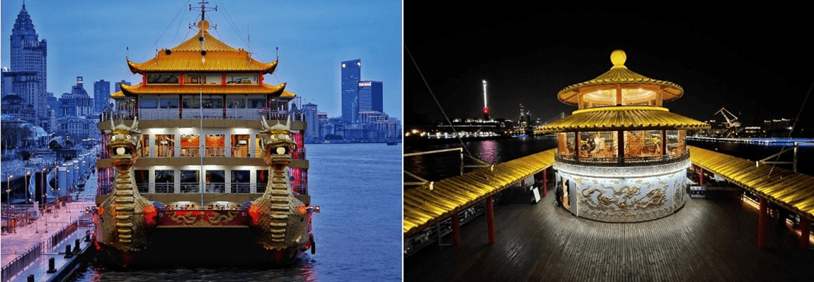
    
Cruise Line:

    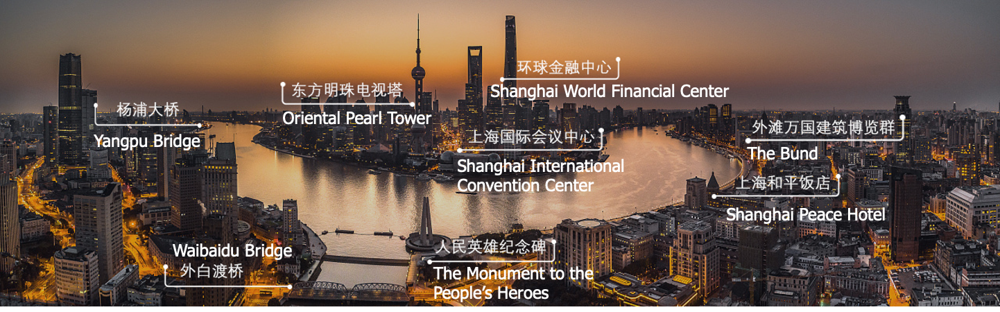
    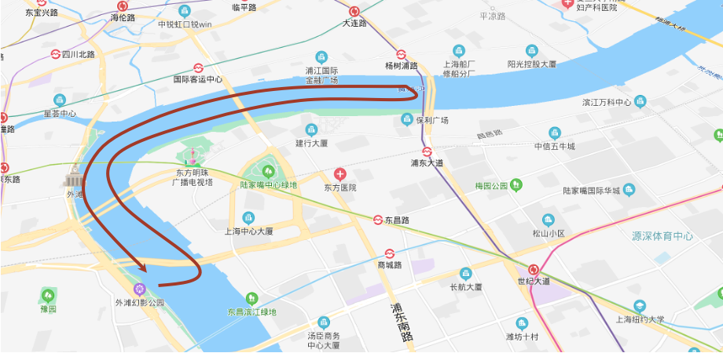
    <h2>Places of Interest in Shanghai</h2>
    <h3>The Bund</h3>
    
With a total length of 4 km, it is a famous tourist attraction in Shanghai. On the west side stands a group of Chinese and Western buildings with different styles. It can be called the "World Architecture Expo" and is a microcosm of modern Shanghai history.

    <strong>Distance from the conference venue: 5KM</strong>
    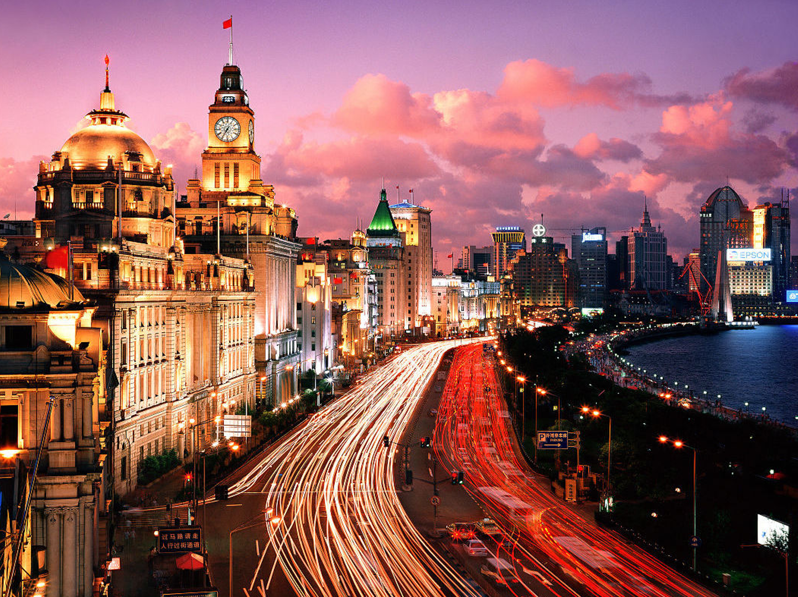
    <h3>The Oriental Pearl Radio & TV Tower</h3>
    
It is one of Shanghai’s iconic cultural landscapes. The tower has landscapes and facilities such as a space capsule, a revolving restaurant, and the Shanghai Urban History Development Exhibition Hall.

    <strong>Distance from the conference venue: 800M</strong>
    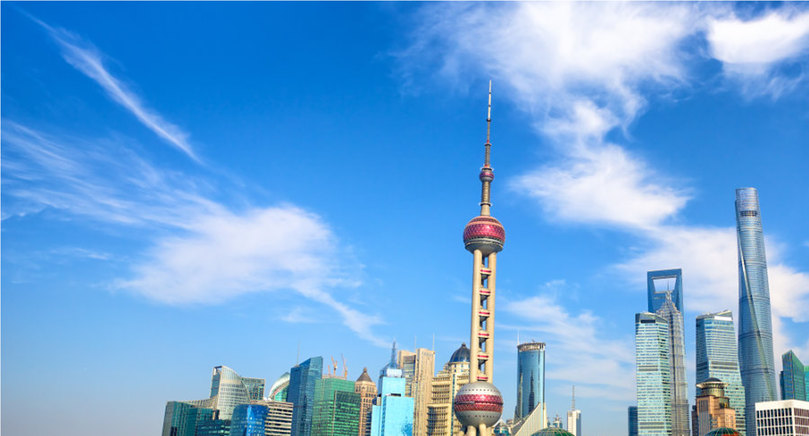
    <h3>Shanghai Tower</h3>
    
The main building has a total height of 632 meters. Here you can overlook the beautiful scenery of Shanghai from 360 degrees, which is a great place to appreciate the charm of the city.

    
The fastest elevator: from 118th to 2nd floor in 1 minute.

    <strong>Distance from the conference venue: 700M</strong>
    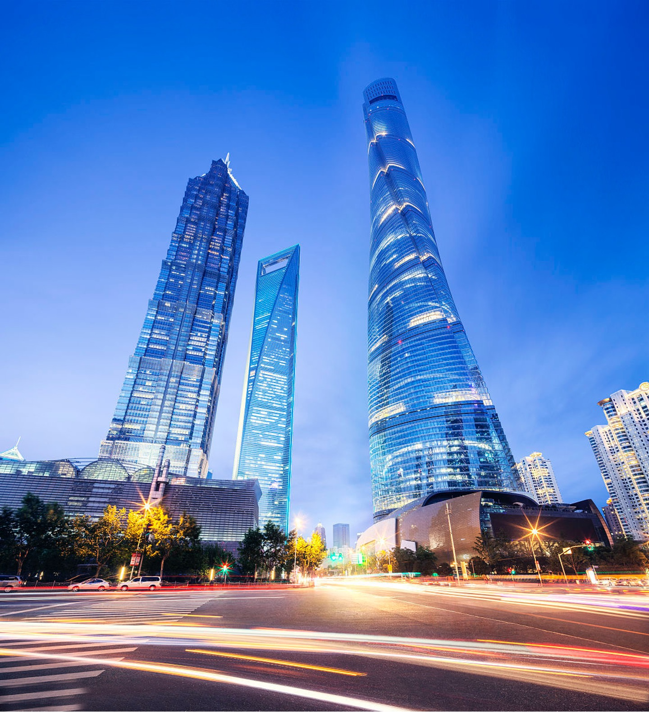
    <h3>Yu Garden</h3>
    
Covering an area of more than 20,000 m2, it was built in the 38th year of Jiajing Ming Dynasty (AD 1559). It is a famous Jiangnan classical garden and is known as the "urban forest".

    <strong>Distance from the conference venue: 5KM</strong>
    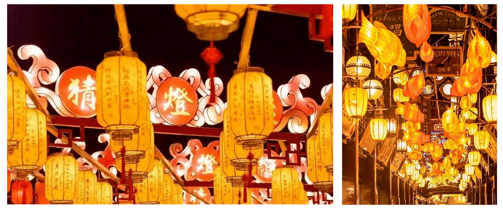
    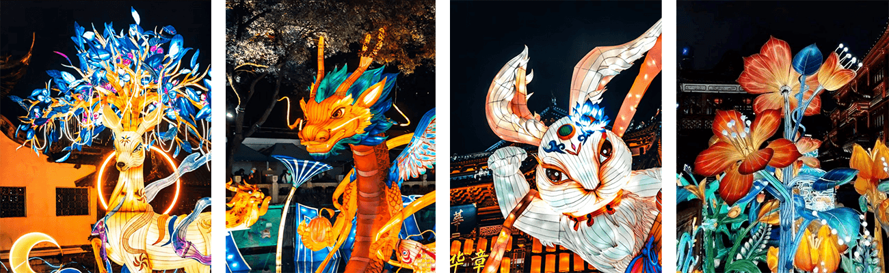
    <h3>Zhujiajiao</h3>
    
It is a typical Jiangnan ancient water town. One of the four famous historical and cultural towns in Shanghai.

    <strong>Distance from the conference venue: 52KM (about 1 hour by taxi)</strong>
    

        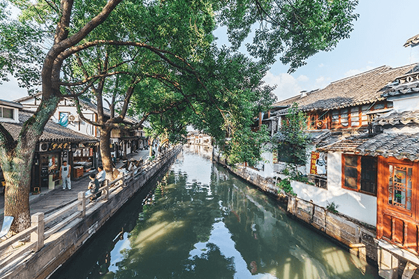
        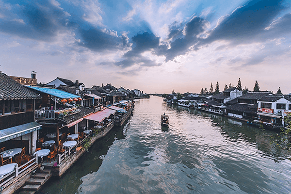
    

    <h3>Gucun Park</h3>
    
It is the largest country park in Shanghai.The Sakura Festival will be held from the end of March to April every year.

    <strong>Distance from the conference venue: 26KM (about 30 minutes by taxi)</strong>
    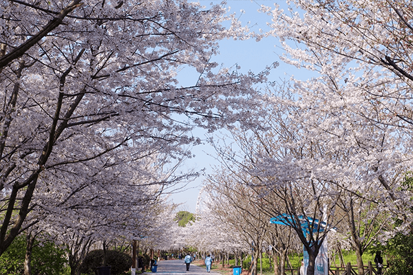
    <h2>Nearby</h2>
    <h3>Yellow Mountain</h3>
    
About 3 hours from Shanghai by train.

    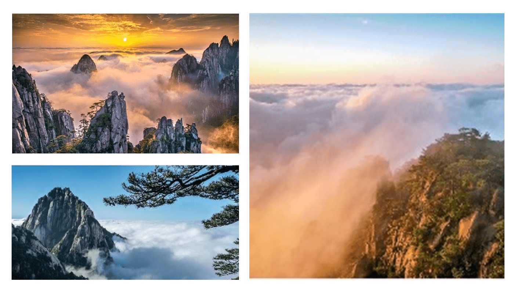
    <h3>Hangzhou</h3>
    
About 1 hour from Shanghai by train.

    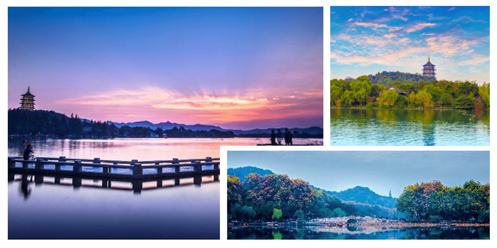
    <h3>Nanjing</h3>
    
About 1 hour from Shanghai by train.

    
    <h3>Suzhou</h3>
    
About 40 minutes from Shanghai by train.

    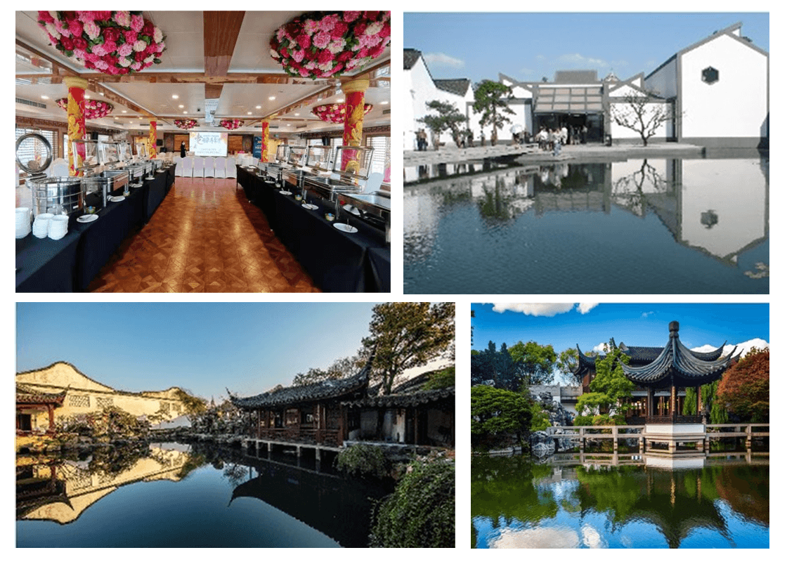

