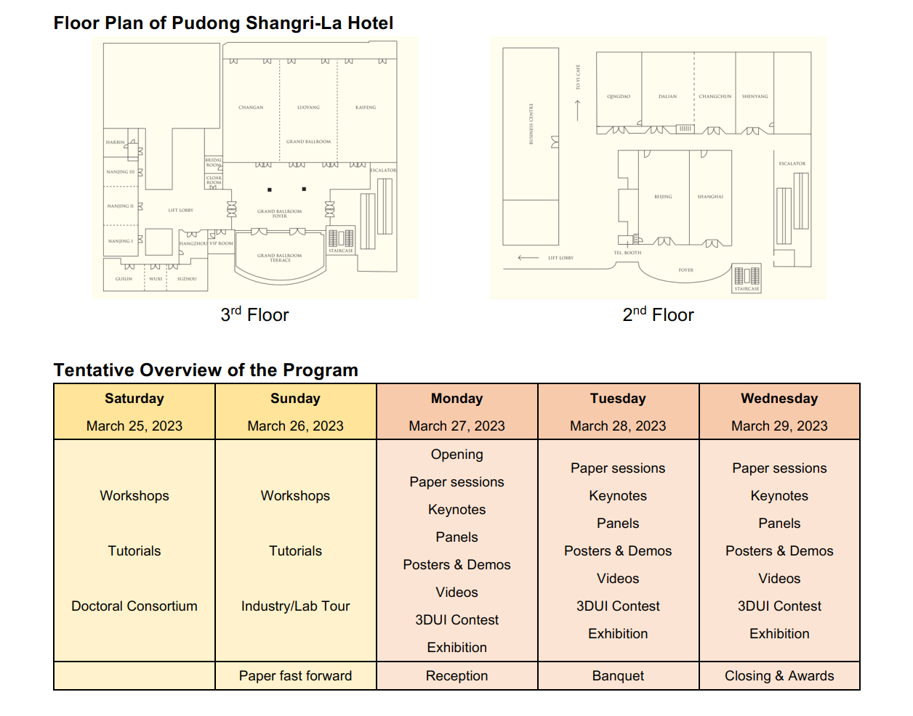
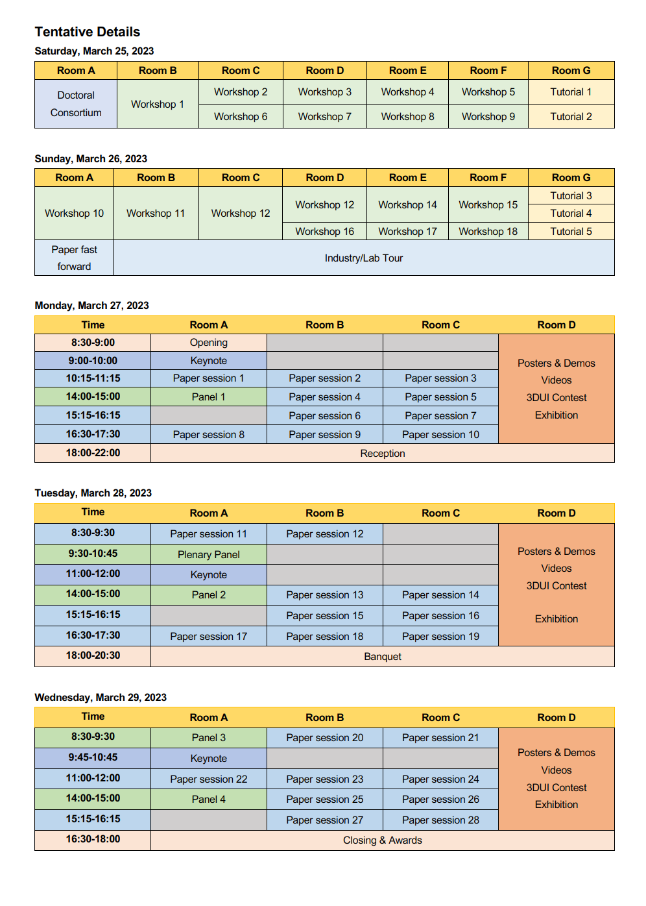

<h1>Program Overview</h1>

<a href="http://ieeevr.org/2023/assets/attend/Tentative_Program_VR2023.pdf" class="btn btn--info" style="" target="_blank">Tentative Program</a> 

        <small>Conference local time</small>
        <iframe src="https://www.zeitverschiebung.net/clock-widget-iframe-v2?language=en&size=small&timezone=Asia%2FShanghai" width="100%" height="140" frameborder="0" seamless></iframe>
        <!-- <iframe src="https://www.zeitverschiebung.net/clock-widget-iframe-v2?language=en&size=small&timezone=Europe%2FLisbon&show=hour_minute" width="100%" height="140" frameborder="0" seamless></iframe> -->

<!-- 

    

        Tentative Program
    

    
    

 -->

<h3 style="color: rgb(255, 45, 85);">Please note that all times are given in Shanghai, China local time (UTC+8).</h3>

<!-- 

    <strong>Locations</strong>
    

        Locations in the program below refer to virtual places in the Virbela platform.
    

    

        

            <a href="/2021/attend/virbela-instructions/" class="btn btn--primary" style="color: white;">Getting Started with Virbela</a>
        

    

 -->
<!--

    <strong>Note:</strong>
    

        The indications for locations in this program refer to virtual locations in the Virbela platform. Please find more information about and how to use Virbela <a href="/2021/attend/virbela-instructions/">here</a>.
    

-->

    
 <input id="collapsible1" class="toggle" type="checkbox" checked> <label for="collapsible1" class="lbl-toggle">Saturday, March 25</label>
        

            

                
<strong>Shanghai, China, UTC+8</strong>

                

                    
                    
                    
                    
                    
                    
                    
                    
                    
                    
8:00

                    

                        <h3 class="session-title"><a href="/2023/program/tutorials/#T5">Tutorial [online]: Demystifying Academic Paper Reviews: How to Construct Quality Reviews for Peer-Reviewed Publications</a></h3>
                        8:00 - 11:30
                        <!-- <b style="color: white;">Location:</b> <a href="/2023/attend/virbela-instructions/#map">Auditorium A</a> -->
                    

                    
08:15

                    

                        <h3 class="session-title"><a href="/2023/contribute/workshoppapers/#VR4Exergame">Workshop [online]: First Workshop on VR for Exergaming (VR4Exergame)</a></h3>
                        8:15 - 13:30
                        <!-- <b style="color: white;">Location:</b> <a href="/2021/attend/virbela-instructions/#map">Auditorium B</a> -->
                    

                    
08:30

                    

                        <h3 class="session-title"><a href="/2023/contribute/workshoppapers/#MASSXR">Workshop [online]: Multi-modal Affective and Social Behavior Analysis and Synthesis in Extended Reality (MASSXR)</a></h3>
                        8:30 - 13:10
                        <!-- <b style="color: white;">Location:</b> <a href="/2021/attend/virbela-instructions/#map">Auditorium B</a> -->
                    

                    

                        <h3 class="session-title"><a href="/2023/contribute/workshoppapers/#TrainingXR">Workshop [online]: 4th Annual Workshop on 3D Content Creation for Simulated Training in eXtended Reality (TrainingXR)</a></h3>
                        8:30 - 11:30
                        <!-- <b style="color: white;">Location:</b> <a href="/2021/attend/virbela-instructions/#map">Auditorium B</a> -->
                    

                    

                        <h3 class="session-title"><a href="/2023/contribute/workshoppapers/#XRIOS">Workshop [online]: 2nd International Workshop on eXtended Reality for Industrial and Occupational Support (XRIOS)</a></h3>
                        8:30 - 18:30
                        <!-- <b style="color: white;">Location:</b> <a href="/2021/attend/virbela-instructions/#map">Auditorium B</a> -->
                    

                    
9:00

                    

                        <h3 class="session-title"><a href="/2023/contribute/workshoppapers/#KELVAR">Workshop [online]: KELVAR Workshop: K-12+ Embodied Learning through Virtual and Augmented Reality</a></h3>
                        8:30 - 11:30
                        <!-- <b style="color: white;">Location:</b> <a href="/2021/attend/virbela-instructions/#map">Auditorium B</a> -->
                    

                    

                        <h3 class="session-title"><a href="/2023/contribute/workshoppapers/#ENPT-XR">Workshop [online]: Workshop on Emerging Novel Prototyping Techniques for XR (ENPT XR)</a></h3>
                        8:30 - 16:30
                        <!-- <b style="color: white;">Location:</b> <a href="/2021/attend/virbela-instructions/#map">Auditorium B</a> -->
                    

                    

                        <h3 class="session-title"><a href="/2023/program/doctoral-consortium/">Doctoral Consortium</a></h3>
                        9:00 - 12:30
                    

                    
10:00

                    
11:00

                    
11:30

                    
12:00

                    
13:00

                    
14:00

                    

                        <h3 class="session-title"><a href="/2023/contribute/workshoppapers/#XRHealth">Workshop [online]: 2nd XR Health workshop - XR Technologies for Healthcare and Wellbeing (XR Health)</a></h3>
                        14:00 - 17:00
                        <!-- <b style="color: white;">Location:</b> <a href="/2021/attend/virbela-instructions/#map">Auditorium B</a> -->
                    

                    

                        <h3 class="session-title"><a href="/2023/contribute/workshoppapers/#ReDigiTS">Workshop [hybrid]: 3D Reconstruction| Digital Twinning| and Simulation for Virtual Experiences (ReDigiTS)</a></h3>
                        14:00 - 17:00
                        <!-- <b style="color: white;">Location:</b> <a href="/2021/attend/virbela-instructions/#map">Auditorium C</a> -->
                    

                    

                        <h3 class="session-title"><a href="/2023/program/doctoral-consortium/">Doctoral Consortium</a></h3>
                        14:00 - 17:30
                    

                    
15:00

                    
16:00

                    
17:00

                    

                        <h3 class="session-title">
                            <a href="/2023/program/tutorials/#T2">
                                Tutorial [online]: Introduction to Building Social Virtual Reality with Ubiq
                            </a>
                        </h3>
                        17:00 - 18:30
                        <!-- <b style="color: white;">Location:</b> <a href="/2021/attend/virbela-instructions/#map">Auditorium A</a> -->
                    

                    
17:30

                    
18:00

                    
18:30

                

            

        

    

    
 <input id="collapsible2" class="toggle" type="checkbox" checked> <label for="collapsible2" class="lbl-toggle">Sunday, March 26</label>
        

            

                
<strong>Shanghai, China, UTC+8</strong>

                

                    
                    
                    
                    
                    
                    
                    
                    
                    
8:00

                    

                        <h3 class="session-title"><a href="/2023/contribute/workshoppapers/#WIVL">Workshop [online]: Workshop on Immersive Visualization Laboratories - Past Present and Future</a></h3>
                        8:00 - 13:40
                        <!-- <b style="color: white;">Location:</b> <a href="/2021/attend/virbela-instructions/#map">Auditorium B</a> -->
                    

                    

                        <h3 class="session-title"><a href="/2023/contribute/workshoppapers/#SecImmeWorld"> Workshop [online]: First Workshop on Security and Privacy for Immersive Virtual Worlds (Secure Immersive Worlds)</a></h3>
                        8:15 - 14:00
                        <!-- <b style="color: white;">Location:</b> <a href="/2021/attend/virbela-instructions/#map">Auditorium B</a> -->
                    

                    
9:00

                    

                        <h3 class="session-title"><a href="/2023/contribute/workshoppapers/#Data4XR">Workshop [hybrid]: Data4XR: Datasets for Developing Intelligent XR Applications</a></h3>
                        9:00 - 12:00
                    

                    

                        <h3 class="session-title"><a href="/2023/contribute/workshoppapers/#MixReal">Workshop [hybrid]: Mixing Realities: Cross-reality Visualization| Interaction| and Collaboration </a></h3>
                        9:00 - 12:00
                    

                    

                        <h3 class="session-title"><a href="/2023/contribute/workshoppapers/#EUCHS">Workshop [online]: Enhancing User Comfort| Health| and Safety in VR and AR</a></h3>
                        9:00 - 12:00
                    

                    

                        <h3 class="session-title"><a href="/2023/contribute/workshoppapers/#WISP">Workshop [online]: Workshop on Immersive Sickness Prevention (WISP)</a></h3>
                        9:00 - 12:00
                    

                    

                        <h3 class="session-title"><a href="/2023/program/tutorials/#T4">Tutorial [hybrid]: Introduction to Building Digital human with 3D and 4D Face Capture</a></h3>
                        9:00 - 10:30
                    

                    
10:00

                    
11:00

                    

                        <h3 class="session-title"><a href="/2023/program/tutorials/#T1">Tutorial [hybrid]: Towards Building Automated Non-Rigid Spatially Augmented Reality</a></h3>
                        11:00 - 12:30
                    

                    
12:00

                    
13:00

                    
14:00

                    
15:00

                    

                        <h3 class="session-title"><a href="/2023/contribute/workshoppapers/#ANIVAE-2023">Workshop [hybrid]: 6th IEEE VR Internal Workshop on Animation in Virtual and Augmented Environments (ANIVAE-2023)</a></h3>
                        14:00 - 16:30
                    

                    

                        <h3 class="session-title"><a href="/2023/contribute/workshoppapers/#I-Meta">Workshop [hybrid]:  Industrial Metaverse (I-Meta) </a></h3>
                        14:00 - 16:00
                    

                    

                        <h3 class="session-title"><a href="/2023/contribute/workshoppapers/#ARES">Workshop [online]: ARES - Augmented Reality Enabling Superhuman Sports + Serious Games (2nd Annual Workshop)</a></h3>
                        14:00 - 17:00
                    

                    

                        <h3 class="session-title"><a href="/2023/contribute/workshoppapers/#OAT"> Workshop [online]: Open Access Tools and libraries for virtual reality (OAT)</a></h3>
                        14:00 - 17:00
                    

                    

                        <h3 class="session-title"><a href="/2023/program/tutorials/#T3"> Tutorial [hybrid]: Introduction of building XR environments using Omniverse</a></h3>
                        14:00 - 17:30
                    

                    
16:00

                    
17:00

                    
18:00

                    
19:00

                    

                        <h3 class="session-title"> Paper fast forward</h3>
                        19:00 - 20:30
                    

                    
20:00

                    
21:00

                

            

        

    

    
 <input id="collapsible3" class="toggle" type="checkbox" checked> <label for="collapsible3" class="lbl-toggle">Monday, March 27</label>
        

            

                
<strong>Shanghai, China, UTC+8</strong>

                

                    
                    
                    
                    
                    
                    
                    
8:30

                    

                        <h3 class="session-title">Opening</h3>
                        8:30 - 9:00
                    

                    
9:00

                    

                        <h3 class="session-title"><a href="/2023/program/keynote-speakers/#keynote-guo"> Keynote1</a></h3>
                        9:00 - 10:00
                    

                    
10:00

                    

                        <h3 class="session-title">break</h3>
                        10:00 - 10:15
                    

                    

                    <h3 class="session-title"><a href="/2023/program/papers/#5"> Paper Session1 Rendering</a></h3>
                        10:15 - 11:15
                    

                    

                    <h3 class="session-title"><a href="/2023/program/papers/#3">Paper Session3 Locomotion</a></h3>
                        10:15 - 11:15
                    

                    

                        <h3 class="session-title"><a href="/2023/program/papers/#2">Paper Session2 Collaboration</a></h3>
                        10:15 - 11:15
                    

                    

                        <h3 class="session-title"><a href="/2023/program/social-events/#industry-forum">Industry Forum</a></h3>
                        10:00 - 17:00
                    

                    
11:00

                    

                        <h3 class="session-title"><a>Posters & Demos & 3DUI Contest fast forward: session 1</a></h3>
                        11:15 - 12:00
                    

                    

                        <h3 class="session-title">lunch</h3>
                        12:00 - 13:30
                    

                    

                        <h3 class="session-title">Exhibition</h3> 
                        10:00 - 12:00
                    

                    

                        <h3 class="session-title">Exhibition</h3> 
                        <h3 class="session-title">Posters: session 1</h3>
                         
                        <h3 class="session-title">Research Demos</h3>
                         
                        <h3 class="session-title">3DUI Contest</h3>
                         
                        <h3 class="session-title">Videos</h3>
                        12:00 - 13:30
                    

                    

                        <h3 class="session-title">Exhibition</h3> 
                        13:30 - 17:00
                    

                    
12:00

                    
13:00

                    

                        <h3 class="session-title"><a href="/2023/program/panels/#P1">Panel 1: Advancing Interactions in XR: Exploring New Input Technologies for the Metaverse</a></h3>
                        13:30 - 14:30
                    

                    

                        <h3 class="session-title"><a href="/2023/program/papers/#4">Paper Session4 Locomotion</a></h3>
                        13:30 - 14:30
                    

                    

                        <h3 class="session-title"><a href="/2023/program/papers/#1">Paper Session5 Audio</a></h3>
                        13:30 - 14:30
                    

                    
14:00

                    
15:00

                    

                        <h3 class="session-title">break</h3>
                        14:30 - 14:45
                    

                    

                        <h3 class="session-title"><a href="/2023/program/papers/#7">Paper Session6 Tracking</a></h3>
                        14:45 - 15:45
                    

                    

                        <h3 class="session-title"><a href="/2023/program/papers/#6">Paper Session7 Rendering</a></h3>
                        14:45 - 15:45
                    

                    

                        <h3 class="session-title"><a href="/2023/program/papers/#12">Paper Session8 Cybersickness and SocialEmotional</a></h3>
                        14:45 - 15:45
                    

                    

                        <h3 class="session-title">break</h3>
                        15:45 - 16:00
                    

                    
16:00

                    

                        <h3 class="session-title"><a href="/2023/program/papers/#8">Paper Session9 360Video and Applications</a></h3>
                        16:00 - 17:00
                    

                    

                        <h3 class="session-title"><a href="/2023/program/papers/#9">Paper Session10 Agents</a></h3>
                        16:00 - 17:00
                    

                    
17:00

                    
18:00

                    

                        <h3 class="session-title"><a href="/2023/program/social-events/#reception">Reception</a></h3>
                        18:00 - 22:00
                    

                    
22:00

                

            

        

    

    
 <input id="collapsible28" class="toggle" type="checkbox" checked> <label for="collapsible28" class="lbl-toggle">Tuesday, March 28</label>
        

            

                
<strong>Shanghai, China, UTC+8</strong>

                

                    
                    
                    
                    
                    
                    
                    
08:30

                    

                        <h3 class="session-title"><a href="/2023/program/papers/#14">Paper Session11 Displays and Haptics</a></h3>
                        8:30 - 9:30
                    

                    

                        <h3 class="session-title"><a href="/2023/program/papers/#11">Paper Session12 Cybersickness</a></h3>
                        8:30 - 9:30
                    

                    

                        <h3 class="session-title"><a href="/2023/program/social-events/#industry-forum">Industry Forum</a></h3>
                        8:30 - 17:00
                    

                    
09:00

                    

                        <h3 class="session-title"><a href="/2023/program/panels/#PP">Plenary Panel: Revisiting what is real about VR</a></h3>
                        9:30 - 10:45
                    

                    
10:00

                    

                        <h3 class="session-title">break</h3>
                        10:45 - 11:00
                    

                    
11:00

                    

                        <h3 class="session-title"><a href="/2023/program/keynote-speakers/#keynote-gao">Keynote2</a></h3>
                        11:00 - 12:00
                    

                    
12:00

                    

                        <h3 class="session-title"><a href="/2023/program/keynote-speakers/#keynote-gao">Posters & Demos & 3DUI Contest fast forward: session 2</a></h3>
                        12:00 - 12:45
                    

                    

                        <h3 class="session-title">lunch</h3>
                        12:45 - 14:00
                    

                    
13:00

                    
14:00

                    

                        <h3 class="session-title">Exhibition</h3> 
                        08:30 - 12:45
                    

                    

                        <h3 class="session-title">Exhibition</h3> 
                        <h3 class="session-title">Posters: session 2</h3>
                         
                        <h3 class="session-title">Research Demos</h3>
                         
                        <h3 class="session-title">3DUI Contest</h3>
                         
                        <h3 class="session-title">Videos</h3>
                        12:45 - 14:00
                    

                    

                        <h3 class="session-title">Exhibition</h3> 
                        14:00 - 17:30
                    

                    <!-- 

                        <h3 class="session-title"><a>Posters & Demos: session 2</a></h3>
                        12:30 - 14:00
                    
 -->
                    <!-- 

                        <h3 class="session-title"><a>3DUI Contest</a></h3>
                        12:30 - 14:00
                    
 -->
                    <!-- 

                        <h3 class="session-title"><a>Videos</a></h3>
                        12:30 - 14:00
                    
 -->
                    

                        <h3 class="session-title"><a href="/2023/program/panels/#P2">Panel2: Can a visual design and game approach for VR increase engagement with health issues?</a></h3>
                        14:00 - 15:00
                    

                    

                        <h3 class="session-title"><a href="/2023/program/papers/#15">Paper Session13 Gaze</a></h3>
                        14:00 - 15:00
                    

                    

                        <h3 class="session-title"><a href="/2023/program/papers/#17">Paper Session14
                        Interaction</a></h3>
                        14:00 - 15:00
                    

15:00

                    

                        <h3 class="session-title">break</h3>
                        15:00 - 15:15
                    

                    

                        <h3 class="session-title"><a href="/2023/program/papers/#10">Paper Session15 Accessibility and Applications</a></h3>
                        15:15 - 16:15
                    

                    

                        <h3 class="session-title"><a  href="/2023/program/papers/#18">Paper Session16 Interaction</a></h3>
                        15:15 - 16:15
                    

                    

                        <h3 class="session-title"><a  href="/2023/program/papers/#13">Paper Session17 Display</a></h3>
                        15:15 - 16:15
                    

                    
16:00

                    

                        <h3 class="session-title">break</h3>
                        16:15 - 16:30
                    

                    
17:00

                    

                        <h3 class="session-title">Set up for Banquet</h3>
                        17:00 - 18:00
                    

                     

                        <h3 class="session-title">Set up for Banquet</h3>
                        17:00 - 18:00
                    

                    

                        <h3 class="session-title"><a href="/2023/program/papers/#20">Paper Session18 Medical</a></h3>
                        16:30 - 17:30
                    

                    

                        <h3 class="session-title"><a href="/2023/program/papers/#16">Paper Session19 Haptics</a></h3>
                        16:30 - 17:30
                    

                    
18:00

                    

                        <h3 class="session-title"><a href="/2023/program/social-events/#banquet">Banquet</a> & <a href="/2023/program/keynote-speakers/#keynote-lin">Keynote</a></h3>
                        18:00 - 20:30
                    

                    
19:00

                    
20:00

                

            

        

    

    
 <input id="collapsible29" class="toggle" type="checkbox" checked> <label for="collapsible29" class="lbl-toggle">Wednesday, March 29</label>
        

            

                
<strong>Shanghai, China, UTC+8</strong>

                

                    
                    
                    
                    
                    
                    
                    
                    
                    
08:30

                    

                        <h3 class="session-title"><a href="/2023/program/papers/#19">Paper Session20 Gestures and Interaction</a></h3>
                        8:30 - 9:30
                    

                    

                        <h3 class="session-title"><a href="/2023/program/papers/#21">Paper Session21 Perception</a></h3>
                        8:30 - 9:30
                    

                    

                        <h3 class="session-title"><a href="/2023/program/panels/#P3">Panel3 [online]: Standards for Virtual Reality</a></h3>
                        8:30 - 9:30
                    

                    
09:30

                    

                        <h3 class="session-title">break</h3>
                        9:30 - 9:45
                    

                    
09:45

                    

                        <h3 class="session-title"><a>Keynote3</a></h3>
                        09:45 - 10:45
                    

                    
10:45

                    

                        <h3 class="session-title">break</h3>
                        10:45 - 11:00
                    

                    
11:00

                    

                        <h3 class="session-title"><a href="/2023/program/papers/#22">Paper Session22 Perception</a></h3>
                        11:00 - 12:00
                    

                    

                        <h3 class="session-title"><a href="/2023/program/papers/#23">Paper Session23 SocialEmotional</a></h3>
                        11:00 - 12:00
                    

                    

                        <h3 class="session-title"><a href="/2023/program/papers/#24">Paper Session24 Education and Medical</a></h3>
                        11:00 - 12:00
                    

                    
12:00

                    

                        <h3 class="session-title"><a>Posters & Demos & 3DUI Contest fast forward: session 3</a></h3>
                        12:00 - 12:45
                    

                    
12:45

                    

                        <h3 class="session-title">lunch</h3>
                        12:45 - 14:00
                    

                    

                        <h3 class="session-title">Exhibition</h3> 
                        08:30 - 12:45
                    

                    

                        <h3 class="session-title">Exhibition</h3> 
                        <h3 class="session-title">Posters: session 3</h3>
                         
                        <h3 class="session-title">Research Demos</h3>
                         
                        <h3 class="session-title">3DUI Contest</h3>
                         
                        <h3 class="session-title">Videos</h3>
                        12:45 - 14:00
                    

                    

                        <h3 class="session-title">Exhibition</h3> 
                        14:00 - 17:00
                    

                    
14:00

                    

                        <h3 class="session-title"><a href="/2023/program/panels/#P4">Panel4: Challenges and Opportunities of XR Applications for High-Risk Incidents</a></h3>
                        14:00 - 15:00
                    

                    

                        <h3 class="session-title"><a href="/2023/program/papers/#25">Paper Session25 Multimodal and Haptics</a></h3>
                        14:00 - 15:00
                    

                    

                        <h3 class="session-title"><a href="/2023/program/papers/#26">Paper Session26 Agents and Perception</a></h3>
                        14:00 - 15:00
                    

                    
15:00

                    

                        <h3 class="session-title">break</h3>
                        15:00 - 15:15
                    

                    
15:15

                    

                        <h3 class="session-title"><a href="/2023/program/papers/#27">Paper Session27 FoveatedRendering, Gaze, and Haptics</a></h3>
                        15:15 - 16:15
                    

                    

                        <h3 class="session-title"><a href="/2023/program/papers/#28">Paper Session28 InfoVis and TextEntry</a></h3>
                        15:15 - 16:15
                    

                    
16:15

                    

                        <h3 class="session-title">break</h3>
                        16:15 - 16:45
                    

                    
16:30

                    

                        <h3 class="session-title"><a>Closing & Awards</a></h3>
                        17:00 - 17:30
                    

                    
17:00

                    <!-- 

                        <h3 class="session-title"><a>Posters & Demos: session 3</a></h3>
                        12:30 - 14:00
                    
 -->
                    <!-- 

                        <h3 class="session-title"><a>3DUI Contest</a></h3>
                        12:30 - 14:00
                    
 -->
                    <!-- 

                        <h3 class="session-title"><a>Videos</a></h3>
                        12:30 - 14:00
                    
 -->
                

            

        

    

<!--

    
 <input id="collapsible3" class="toggle" type="checkbox" checked> <label for="collapsible3" class="lbl-toggle">Monday, March 29</label>
        

            

                
<strong>Lisbon WEST, UTC+1</strong>

                

                    
                    
                    
                    
                    

                    
8:30

                    

                        <h3 class="session-title"><a href="/2021/program/plenary-sessions/#O1">Opening</a></h3>
                        8:30 - 10:00
                        <b style="color: white;">Location:</b> <a href="/2021/attend/virbela-instructions/#map">Auditorium A</a>
                    

                    
10:00

                    

                        <h3 class="session-title">Break</h3>
                    

                    
10:30

                    

                        <h3 class="session-title"><a href="http://ieeevr.org/2021/program/keynote-speakers/#keynote-mohler">Keynote by Betty Mohler, Self-avatars in Immersive Technology</a></h3>
                        10:30 - 11:30
                        <b style="color: white;">Location:</b> <a href="/2021/attend/virbela-instructions/#map">Auditorium A</a>
                    

                    
11:30

                    

                        <h3 class="session-title">Break</h3>
                    

                    
12:00

                    

                        <h3 class="session-title">Papers: <a href="/2021/program/papers/#3.1">Augmented Reality</a></h3>
                        12:00 - 13:00
                        <b style="color: white;">Location:</b> <a href="/2021/attend/virbela-instructions/#map">Auditorium A</a>
                    

                    

                        <h3 class="session-title">Papers: <a href="/2021/program/papers/#3.2">VR/AR Displays</a></h3>
                        12:00 - 13:00
                        <b style="color: white;">Location:</b> <a href="/2021/attend/virbela-instructions/#map">Auditorium B</a>
                    

                    
13:00

                    

                        <h3 class="session-title">Lunch</h3>
                    

                    
14:00

                    

                        <h3 class="session-title">Papers: <a href="/2021/program/papers/#5.1">Emotion and Cognition</a></h3>
                        14:00 - 15:00
                        <b style="color: white;">Location:</b> <a href="/2021/attend/virbela-instructions/#map">Auditorium A</a>
                    

                    

                        <h3 class="session-title">Papers: <a href="/2021/program/papers/#5.2">Holographic and Inertial Displays</a></h3>
                        14:00 - 15:00
                        <b style="color: white;">Location:</b> <a href="/2021/attend/virbela-instructions/#map">Auditorium B</a>
                    

                    
15:00

                    

                        <h3 class="session-title"><a href="/2021/program/posters/">Posters</a> and <a href="/2021/program/demos/">Demos</a></h3>
                        15:00 - 16:30
                        <b style="color: white;">Location:</b> <a href="/2021/attend/virbela-instructions/#map">Expo Hall A</a>
                    

                    

                        <h3 id="EX1" class="session-title"><a href="/2021/program/exhibitors/">Exhibition Hours</a></h3>
                        15:00 - 16:30
                        <b style="color: white;">Location:</b> <a href="/2021/attend/virbela-instructions/#map">Expo Hall A and B</a>
                    

                    
16:30

                    

                        <h3 class="session-title">Papers: <a href="/2021/program/papers/#7.1">Embodiment</a></h3>
                        16:30 - 17:30
                        <b style="color: white;">Location:</b> <a href="/2021/attend/virbela-instructions/#map">Auditorium A</a>
                    

                    

                        <h3 class="session-title">Papers: <a href="/2021/program/papers/#7.2">Visualization</a></h3>
                        16:30 - 17:30
                        <b style="color: white;">Location:</b> <a href="/2021/attend/virbela-instructions/#map">Auditorium B</a>
                    

                    

                        <h3 id="EX1" class="session-title">Expo Session:</h3>
                        16:30: Qualcomm
                        16:35: <a style="color: white;" href="https://www.youtube.com/watch?v=Sgw1DSbbSMY">Microsoft</a>
                        16:40: <a style="color: white;" href="https://www.youtube.com/watch?v=nq0NdCiB3FI">Facebook</a>
                        <b style="color: white;">Location:</b> <a href="/2021/attend/virbela-instructions/#map">Theater</a>
                    

                    
17:30

                    

                        <h3 class="session-title"><a href="/2021/program/plenary-sessions/#O2">Welcome Reception</a> (including <a href="/2021/awards/vgtc-award-winners/">VGTC Awards</a>)</h3>
                        17:30 - 19:00
                        <b style="color: white;">Location:</b> <a href="/2021/attend/virbela-instructions/#map">Auditorium A</a>
                    

                    

                        <h3 id="EW" class="session-title"><a href="/2021/program/exhibitors/">Exhibitors: Welcome Reception</a></h3>
                        <a style="color: white;" href="https://www.youtube.com/watch?v=Et-8EIRN_mw&t=4s">Virbela</a>
                        17:30 - 18:30
                        <b style="color: white;">Location:</b> <a href="/2021/attend/virbela-instructions/#map">Auditorium A</a>
                    

                

            

        

    

    
 <input id="collapsible7" class="toggle" type="checkbox" checked> <label for="collapsible7" class="lbl-toggle">Tuesday, March 30</label>
        

            

                
<strong>Lisbon WEST, UTC+1</strong>

                

                    
                    
                    
                    
                    

                    
8:30

                    

                        <h3 class="session-title">Papers: <a href="/2021/program/papers/#1.1">Collaboration</a></h3>
                        8:30 - 9:30
                        <b style="color: white;">Location:</b> <a href="/2021/attend/virbela-instructions/#map">Auditorium A</a>
                    

                    

                        <h3 class="session-title">Papers: <a href="/2021/program/papers/#1.2">Multimodal Interfaces</a></h3>
                        8:30 - 9:30
                        <b style="color: white;">Location:</b> <a href="/2021/attend/virbela-instructions/#map">Auditorium B</a>
                    

                    
9:30

                    

                        <h3 class="session-title"><a href="/2021/program/posters/">Posters</a> and <a href="/2021/program/demos/">Demos</a></h3>
                        9:30 - 11:00
                        <b style="color: white;">Location:</b> <a href="/2021/attend/virbela-instructions/#map">Expo Hall B</a>
                    

                    

                        <h3 id="EX2" class="session-title"><a href="/2021/program/exhibitors/">Exhibition Hours</a></h3>
                        9:30 - 11:00
                        <b style="color: white;">Location:</b> <a href="/2021/attend/virbela-instructions/#map">Expo Hall A and B</a>
                    

                    
11:00

                    

                        <h3 class="session-title">Papers: <a href="/2021/program/papers/#2.1">Security and Drone Teleoperation</a></h3>
                        11:00 - 12:00
                        <b style="color: white;">Location:</b> <a href="/2021/attend/virbela-instructions/#map">Auditorium A</a>
                    

                    

                        <h3 class="session-title">Papers: <a href="/2021/program/papers/#2.2">Embedded and Surround Videos</a></h3>
                        11:00 - 12:00
                        <b style="color: white;">Location:</b> <a href="/2021/attend/virbela-instructions/#map">Auditorium B</a>
                    

                    
12:00

                    

                        <h3 class="session-title">Lunch</h3>
                    

                    
13:00

                    

                        <h3 class="session-title">Papers: <a href="/2021/program/papers/#4.1">Virtual Humans and Agents</a></h3>
                        13:00 - 14:00
                        <b style="color: white;">Location:</b> <a href="/2021/attend/virbela-instructions/#map">Auditorium A</a>
                    

                    

                        <h3 class="session-title">Papers: <a href="/2021/program/papers/#4.2">Hands, Gestures and Grasping</a></h3>
                        13:00 - 14:00
                        <b style="color: white;">Location:</b> <a href="/2021/attend/virbela-instructions/#map">Auditorium B</a>
                    

                    
14:00

                    

                        <h3 class="session-title">Break</h3>
                    

                    
14:30

                    

                        <h3 class="session-title">
                            <a href="http://ieeevr.org/2021/program/keynote-speakers/#keynote-oliver">Keynote by Nuria Oliver, Data Science to fight against COVID-19</a>
                        </h3>
                        14:30 - 15:30
                        <b style="color: white;">Location:</b> <a href="/2021/attend/virbela-instructions/#map">Auditorium A</a>
                    

                    
15:30

                    

                        <h3 class="session-title">Break</h3>
                    

                    
16:00

                    

                        <h3 class="session-title">Social Event: <a href="/2021/program/bofs/">Birds of a Feather</a></h3>
                        16:00 - 17:00
                    

                    

                        <h3 id="EX3" class="session-title"><a href="/2021/program/exhibitors/">Exhibition Hours</a></h3>
                        16:00 - 17:00
                        <b style="color: white;">Location:</b> <a href="/2021/attend/virbela-instructions/#map">Expo Hall A and B</a>
                    

                    
17:00

                    

                        <h3 class="session-title">Papers: <a href="/2021/program/papers/#8.1">Plausibility, Presence and Social VR</a></h3>
                        17:00 - 18:00
                        <b style="color: white;">Location:</b> <a href="/2021/attend/virbela-instructions/#map">Auditorium A</a>
                    

                    

                        <h3 class="session-title"><a href="/2021/program/panels/#P1">Panel: Opportunities and Challenges in Harnessing VR Technology for Bias Mitigation</a></h3>
                        17:00 - 18:30
                        <b style="color: white;">Location:</b> <a href="/2021/attend/virbela-instructions/#map">Auditorium B</a>
                    

                    
18:00

                    

                        <h3 class="session-title">Mixer</h3>
                        18:00 - 19:00
                        <b style="color: white;">Location:</b> <a href="/2021/attend/virbela-instructions/#map">Music Hall</a>
                        
                    

                

            

        

    

    
 <input id="collapsible4" class="toggle" type="checkbox" checked> <label for="collapsible4" class="lbl-toggle">Wednesday, March 31</label>
        

            

                
<strong>Lisbon WEST, UTC+1</strong>

                

                    
                    
                    
                    
                    

                    
8:30

                    

                        <h3 class="session-title">Papers: <a href="/2021/program/papers/#1.3">Accessible VR</a></h3>
                        8:30 - 9:30
                        <b style="color: white;">Location:</b> <a href="/2021/attend/virbela-instructions/#map">Auditorium A</a>
                    

                    

                        <h3 class="session-title">Papers: <a href="/2021/program/papers/#1.4">Haptics</a></h3>
                        8:30 - 9:30
                        <b style="color: white;">Location:</b> <a href="/2021/attend/virbela-instructions/#map">Auditorium B</a>
                    

                    
09:30

                    

                        <h3 class="session-title">Social Event: <a href="/2021/program/bofs/">Birds of a Feather</a></h3>
                        9:30 - 10:30
                    

                    

                        <h3 id="EX4" class="session-title"><a href="/2021/program/exhibitors/">Exhibition Hours</a></h3>
                        9:30 - 11:00
                        <b style="color: white;">Location:</b> <a href="/2021/attend/virbela-instructions/#map">Expo Hall A and B</a>
                    

                    

                        <h3 id="EX1" class="session-title">Expo Session:</h3>
                        9:30: <a style="color: white;" href="https://youtu.be/17YUBD7V-KQ">HIT Lab NZ</a>
                        <b style="color: white;">Location:</b> <a href="/2021/attend/virbela-instructions/#map">Theater</a>
                    

                    
10:30

                    

                        <h3 class="session-title">Break</h3>
                    

                    
11:00

                    

                        <h3 class="session-title">Keynote
                            <a href="http://ieeevr.org/2021/program/keynote-speakers/#keynote-steinicke">Keynote by Frank Steinicke, B(l)ending Realities</a>
                        </h3>
                        11:00 - 12:00
                        <b style="color: white;">Location:</b> <a href="/2021/attend/virbela-instructions/#map">Auditorium A</a>
                    

                    
12:00

                    

                        <h3 class="session-title">Lunch</h3>
                    

                    

                        <h3 class="session-title"><a href="/2021/program/3dui-contest/">3DUI Contest Fast Forward</a></h3>
                        12:00 - 12:10
                    

                    
                    

                    
13:00

                    
                    

                        <h3 class="session-title">Mixer</h3>
                        13:00 - 14:00
                    

                   

                    

                        <h3 class="session-title">Papers: <a href="/2021/program/papers/#4.3">Redirected Locomotion</a></h3>
                        13:00 - 14:00
                        <b style="color: white;">Location:</b> <a href="/2021/attend/virbela-instructions/#map">Auditorium A</a>
                    

                    
14:00

                    

                        <h3 class="session-title"><a href="/2021/program/posters/">Posters</a> and <a href="/2021/program/demos/">Demos</a></h3>
                        14:00 - 15:30
                        <b style="color: white;">Location:</b> <a href="/2021/attend/virbela-instructions/#map">Expo Hall A and B</a>
                    

                    

                        <h3 class="session-title"><a href="/2021/program/3dui-contest/">3DUI Contest</a></h3>
                        14:00 - 15:30
                        <b style="color: white;">Location:</b> <a href="/2021/attend/virbela-instructions/#map">Expo Hall A</a>
                    

                    

                        <h3 id="EX5" class="session-title"><a href="/2021/program/exhibitors/">Exhibition Hours</a></h3>
                        14:00 - 15:30
                        <b style="color: white;">Location:</b> <a href="/2021/attend/virbela-instructions/#map">Expo Hall A and B</a>
                    

                    
15:30

                    

                        <h3 class="session-title">Papers: <a href="/2021/program/papers/#6.1">Selection and Manipulation</a></h3>
                        15:30 - 16:30
                        <b style="color: white;">Location:</b> <a href="/2021/attend/virbela-instructions/#map">Auditorium A</a>
                    

                    

                        <h3 class="session-title"><a href="/2021/program/panels/#P2">Panel: Shaping the Future of XR and Arts</a></h3>
                        15:30 - 17:00
                        <b style="color: white;">Location:</b> <a href="/2021/attend/virbela-instructions/#map">Auditorium C</a>
                    

                    
16:30

                    

                        <h3 class="session-title">Break</h3>
                    

                    
17:00

                    

                        <h3 class="session-title">Papers: <a href="/2021/program/papers/#8.2">Training and Learning</a></h3>
                        17:00 - 18:00
                        <b style="color: white;">Location:</b> <a href="/2021/attend/virbela-instructions/#map">Auditorium A</a>
                    

                    

                        <h3 class="session-title">Papers: <a href="/2021/program/papers/#8.3">Pen-based and Hands-free Interaction</a></h3>
                        17:00 - 18:00
                        <b style="color: white;">Location:</b> <a href="/2021/attend/virbela-instructions/#map">Auditorium B</a>
                    

                    
18:00

                    

                        <h3 class="session-title">Mixer</h3>
                        18:00 - 19:00
                    

                

            

        

    

    
 <input id="collapsible5" class="toggle" type="checkbox" checked> <label for="collapsible5" class="lbl-toggle">Thursday, April 1</label>
        

            

                
<strong>Lisbon WEST, UTC+1</strong>

                

                    
                    
                    
                    

                    
8:30

                    

                        <h3 class="session-title">Papers: <a href="/2021/program/papers/#1.5">Locomotion</a></h3>
                        8:30 - 9:30
                        <b style="color: white;">Location:</b> <a href="/2021/attend/virbela-instructions/#map">Auditorium A</a>
                    

                    

                        <h3 class="session-title">Papers: <a href="/2021/program/papers/#1.6">Rendering and Texture Mapping</a></h3>
                        8:30 - 9:30
                        <b style="color: white;">Location:</b> <a href="/2021/attend/virbela-instructions/#map">Auditorium B</a>
                    

                    
09:30

                    

                        <h3 class="session-title">Social Event: <a href="/2021/program/bofs/">Birds of a Feather</a></h3>
                        9:30 - 10:30
                        <b style="color: white;">Location:</b> <a href="/2021/attend/virbela-instructions/#map">Expo Hall A</a>
                    

                    
10:30

                    

                        <h3 class="session-title"><a href="/2021/program/posters/">Posters</a> and <a href="/2021/program/demos/">Demos</a></h3>
                        10:30 - 12:00
                        <b style="color: white;">Location:</b> <a href="/2021/attend/virbela-instructions/#map">Expo Hall A and B</a>
                    

                    

                        <h3 id="EX6" class="session-title"><a href="/2021/program/exhibitors/">Exhibition Hours</a></h3>
                        10:30 - 12:00
                        <b style="color: white;">Location:</b> <a href="/2021/attend/virbela-instructions/#map">Expo Hall A and B</a>
                    

                    
12:00

                    

                        <h3 class="session-title">Papers: <a href="/2021/program/papers/#3.3">Tracking, Vision and Sound</a></h3>
                        12:00 - 13:00
                        <b style="color: white;">Location:</b> <a href="/2021/attend/virbela-instructions/#map">Auditorium A</a>
                    

                    

                        <h3 class="session-title"><a href="/2021/program/panels/#P3">Panel: What makes a virtual human human?</a></h3>
                        12:00 - 13:30
                        <b style="color: white;">Location:</b> <a href="/2021/attend/virbela-instructions/#map">Auditorium B</a>
                    

                    
13:00

                    

                        <h3 class="session-title">Lunch</h3>
                    

                    
14:00

                    

                        <h3 class="session-title">Papers: <a href="/2021/program/papers/#5.3">Perception</a></h3>
                        14:00 - 15:00
                        <b style="color: white;">Location:</b> <a href="/2021/attend/virbela-instructions/#map">Auditorium A</a>
                    

                    

                        <h3 class="session-title">Papers: <a href="/2021/program/papers/#5.4">VR Applications</a></h3>
                        14:00 - 15:00
                        <b style="color: white;">Location:</b> <a href="/2021/attend/virbela-instructions/#map">Auditorium B</a>
                    

                    
15:00

                    

                        <h3 class="session-title">Break</h3>
                    

                    
15:30

                    

                        <h3 class="session-title">
                            <a href="http://ieeevr.org/2021/program/keynote-speakers/#keynote-feiner">Keynote by Steven Feiner, AR Longa, VR Brevis? Thinking About Our Future</a>
                        </h3>
                        15:30 - 16:30
                        <b style="color: white;">Location:</b> <a href="/2021/attend/virbela-instructions/#map">Auditorium A</a>
                    

                    
16:30

                    

                        <h3 class="session-title"><a href="/2021/program/plenary-sessions/#O3">Closing</a></h3>
                        16:30 - 18:00
                        <b style="color: white;">Location:</b> <a href="/2021/attend/virbela-instructions/#map">Auditorium A</a>
                    

                    
17:30

                    

                        <h3 id="EX7" class="session-title"><a href="/2021/program/exhibitors/">Exhibition Hours</a></h3>
                        17:30 - 18:30
                        <b style="color: white;">Location:</b> <a href="/2021/attend/virbela-instructions/#map">Expo Hall A and B</a>
                    

                

            

        

    

    
 <input id="collapsible6" class="toggle" type="checkbox" checked> <label for="collapsible6" class="lbl-toggle">Friday, April 2</label>
        

            

                
<strong>Lisbon WEST, UTC+1</strong>

                

                    
                    
                    
                    

                    
9:00

                    

                        <h3 class="session-title"><a href="/2021/contribute/workshoppapers/#WEVR">Workshop: Everyday Virtual Reality (WEVR)</a></h3>
                        9:00 - 12:00
                        <b style="color: white;">Location:</b> <a href="/2021/attend/virbela-instructions/#map">Auditorium B</a>
                    

                    
13:00

                    

                        <h3 class="session-title"><a href="/2021/contribute/workshoppapers/#EXR">Workshop: Ethics in VR (EXR)</a></h3>
                        13:00 - 16:00
                        <b style="color: white;">Location:</b> <a href="/2021/attend/virbela-instructions/#map">Auditorium C</a>
                    

                    
14:00

                    

                        <h3 class="session-title"><a href="/2021/program/tutorials/#T3">Tutorial: bmlTUX – a simple toolkit for building experiments in Unity</a></h3>
                        14:00 - 16:30
                        <b style="color: white;">Location:</b> <a href="/2021/attend/virbela-instructions/#map">Auditorium A</a>
                    

                    

                        <h3 class="session-title"><a href="/2021/program/tutorials/#T5">Tutorial: Emotion in Virtual Reality</a></h3>
                        14:00 - 16:30
                        <b style="color: white;">Location:</b> <a href="/2021/attend/virbela-instructions/#map">Auditorium B</a>
                    

                    
16:00

                    

                        <h3 class="session-title"><a href="/2021/contribute/workshoppapers/#KELVAR">Workshop: K-12+ Embodied Learning through Virtual and Augmented Reality</a></h3>
                        16:00 - 21:00
                        <b style="color: white;">Location:</b> <a href="/2021/attend/virbela-instructions/#map">Auditorium C</a>
                    

                    
17:00

                    

                        <h3 class="session-title">
                            <a href="/2021/program/tutorials/#T6S3">
                                Tutorial: Combining the Virtual and the Real, Session 3
                            </a>
                        </h3>
                        17:00 - 20:30
                        <b style="color: white;">Location:</b> <a href="/2021/attend/virbela-instructions/#map">Auditorium A</a>
                    

                    

                        <h3 class="session-title"><a href="/2021/contribute/workshoppapers/#Finding-a-way-forward-in-VR-locomotion">Workshop: Finding a way forward in VR locomotion</a></h3>
                        17:00 - 21:00
                        <b style="color: white;">Location:</b> <a href="/2021/attend/virbela-instructions/#map">Auditorium B</a>
                    

                

            

        

    

 -->
