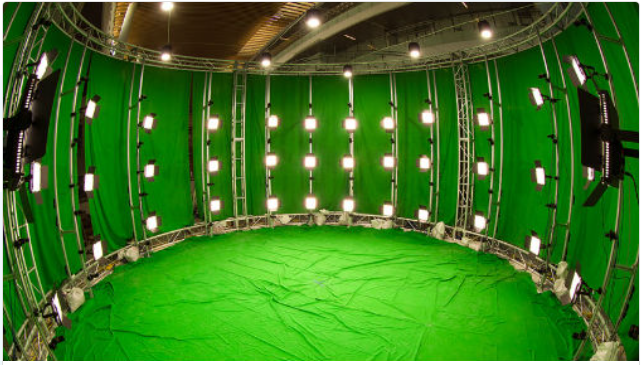
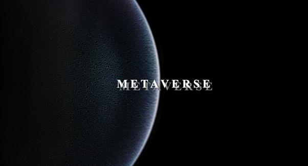
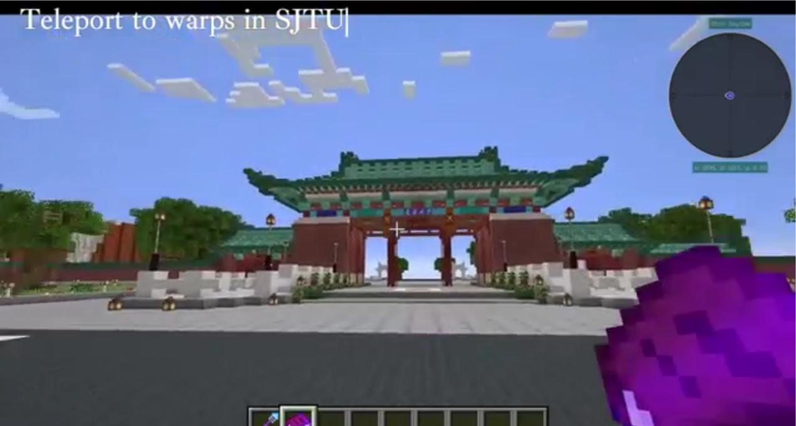
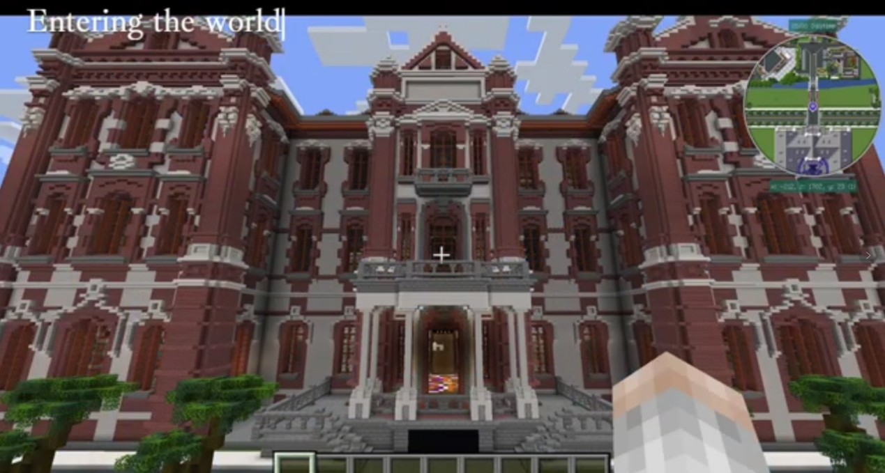
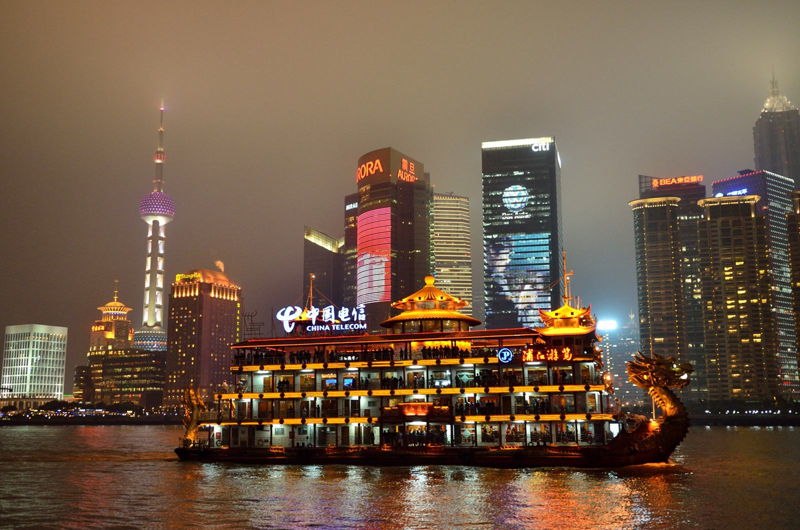
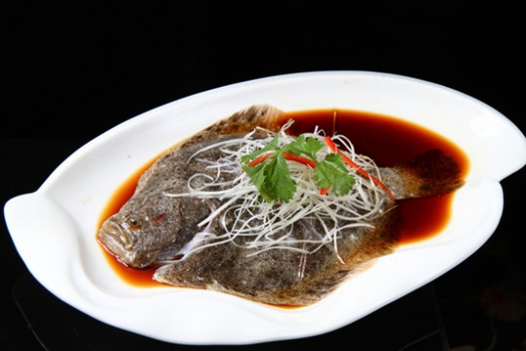
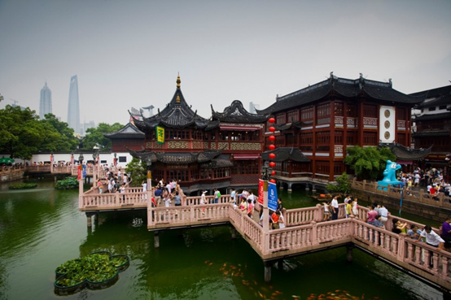
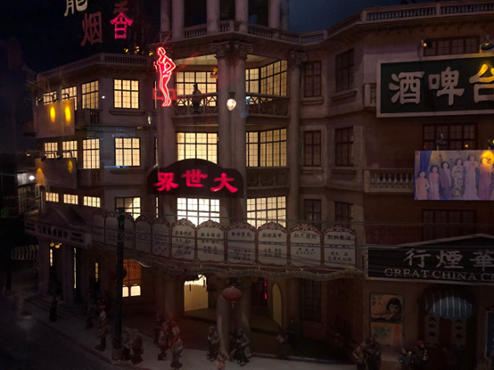
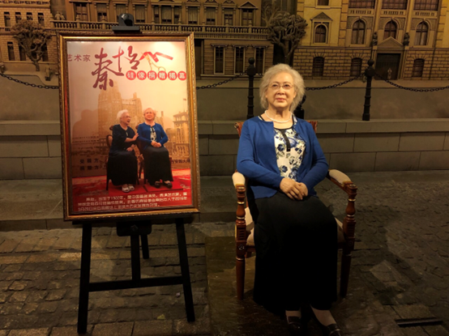

    

        你好，欢迎来到中国，上海
    

    

        Hello and welcome!
    

    <table class="styled-table">
        <tr>
            <th>
                Social Events
            </th>
            <th>
                Time Schedule
            </th>
        </tr>
        <tr>
            <td>
                Industry / Lab Tour
            </td>
            <td>
                Sun.03-26-2023
            </td>
        </tr>
        <tr>
            <td>
                Industry Forum
            </td>
            <td>
                Mon.27-03-2023 –Tues.28-03-2023
            </td>
        </tr>
        <tr>
            <td>
                Online Activities
            </td>
            <td>
                Mon.27-03-2023 –Tues.28-03-2023
            </td>
        </tr>
        <tr>
            <td>
                Student Recruitment
            </td>
            <td>
                Mon.27-03-2023
            </td>
        </tr>
        <tr>
            <td>
                Huangpu River Dinner Cruise (Reception)
            </td>
            <td>
                Mon.27-03-2023
            </td>
        </tr>
        <tr>
            <td>
                Banquet at Shangri-La
            </td>
            <td>
                Tues.28-03-2023
            </td>
        </tr>
        <tr>
            <td>
                One-day tour in Shanghai
            </td>
            <td>
                Thur.30-03-2023
            </td>
        </tr>
    </table>
    <h2>
        Industry/Lab Tour
    </h2>
    

        School of Information Science and Technology, ShanghaiTech University
    

    

        At the SIST of ShanghaiTech University participants can visit the MARS Lab (Multidisciplinary Artificial Reality Studio), and experience a series of VR/AR research facilities. MARS Lab will highlight leading-edge VR and visualization research through various top-tier light-field stages and captured domes for physically-based 4D asset reproduction. It will also demonstrate a series of fascinating applications, i.e., the digital twins for smart cities, hyper-real human generation, VR/AR experiences of dynamic neural radiance fields, immersive holographic interactions, etc.
    

    
    
    
    
    
    <h2>
        Industry Forum
    </h2>
    

        The Industry Forum is an event designed to explore and discuss the most recent advancements regarding metauniverse in the production, education, intelligent manufacturing and cultural tourism industries. During the event, presenters and panelists will provide and exchange detailed information on key technologies and business innovations related to the development of the metauniverse industry, such as its ecology, supporting technology, terminal application, economic system, and development deduction. Furthermore, discussions will focus on the practical implementation of relevant technologies, products and scenarios, as well as providing case studies of successful applications and deployments. By bringing together experts from the field, the Industry Forum aims to encourage the adoption of these technologies and, ultimately, deliver more value to society.
    

    
    <h2>
        Online Activities
    </h2>
    

       The conference will adopt a hybrid approach that combines both online and offline participation. Those unable to attend the event in person will be able to participate through a dedicated Slack channel and a unique in-game Minecraft experience. Details regarding online participation will be provided prior to the commencement of the event. Additionally, a Minecraft replica of Shanghai Jiao Tong University is created to give online participants the chance to experience the university on the 30th anniversary of the IEEE VR Conference. As a special acknowledgment, the organizers have left several Easter eggs within the virtual environment, which all participants are encouraged to explore.
    

    
    
    <h2>
        Student Recruitment
    </h2>
    

       This meeting is intended to utilize a variety of means, such as enterprise communication integration, offline dialogue, and other methods, to facilitate the employment of students and the recruitment of employees for enterprises. This will not only serve as an excellent platform for students, but also provide enterprises with high-quality employees.
    

    <h2>
        Huangpu River Dinner Cruise (Reception)
    </h2>
    

       The IEEE VR 2023 reception will take place beneath the dragon boats of Huangpu River of shanghai. This reception will celebrate the remarkable and splendid achievements of the 30th IEEE Conference on Virtual Reality and 3D User Interfaces with the most advanced researchers, scientists, artists, and entrepreneurs, ensuring that attendees will never be disappointed with their choice.  
       The Huangpu River Dinner Cruise features illuminated dragon boats traveling up and down the Huangpu River. After setting sail, visitors experience the river's magnificent nightscapes. The city’s most famous skyscrapers are outlined in neon and are a sight to behold. Standing on the top deck of the cruise and you will have a glimpse of Shanghai’s past and look into the bright future of the city. Guests can also indulge in a buffet-style dining experience while taking in the stunning night views.
    

    
    <h2>
        Banquet at Shangri-La
    </h2>
    

    The Shangri-La Hotel is pleased to offer a complimentary banquet for all in-person participants. This banquet will provide a unique experience of traditional Chinese cuisine, featuring dishes such as poached chicken from Cantonese cuisine, Kung Pao Chicken from Sichuan cuisine, Aromatic Crispy Duck from authentic Shanghai cuisine, and Braised dishes. An award ceremony and keynote presentations will be held during the grand feast, creating a celebratory atmosphere in which attendees can share in the honor of academic achievements, as well as Chinese cuisine.
    

    
    <!-- 

        

            
            
        

        

            
            
        

    
 -->
    <h2>
        One-day tour in Shanghai
    </h2>
    

    Participants can join in a day-long exploration of Shanghai, which will take them to some of the city's most iconic sights, including Yu Garden, the Oriental Pearl Radio and Television Tower, and the Shanghai Municipal History Museum. 
    

    

    Explore the culture of Shanghai's Old City and take a stroll through the Yu Garden. Step back in time and discover the traditional goods and services of the City God Temper of Shanghai. From time-honored Chinese brands such as Wang Dalong and Liyun Pavilion to unique specialty shops like chopsticks and walking stick vendors, this area has something for everyone. Experience the charm of Shanghai's past and present in this one-of-a-kind destination.
    

    
    

    Experience the beauty and culture of Shanghai by visiting the Oriental Pearl Radio and Television Tower. Climb to the observation deck of the iconic tower and take in the breathtaking panoramic views of the Huangpu River. Standing at 468 meters, it is one of the first National AAAAA Level Scenic Spots in China and offers a variety of experiences, from the space capsules to the revolving restaurant, exhibition halls of Shanghai's urban history and development, and more.
    

    
    

    Shanghai Municipal History Museum is in the Oriental Pearl Radio and TV Tower, which is an image display reflecting the changes of Shanghai's modern history. From the six themed exhibition sections, such as "Style and Features in the Town" and "Past Footsteps in Shanghai," visitors can explore the development of Shanghai through more than 80 scenic spots, hundreds of historical relics, and 117 life-size wax figures. Marvel at the nearly 1000 small wax figures and clay figurines, as well as the thousand pieces of precious cultural relics, which offer insight into the folk customs of Old Shanghai.
    

    
    

