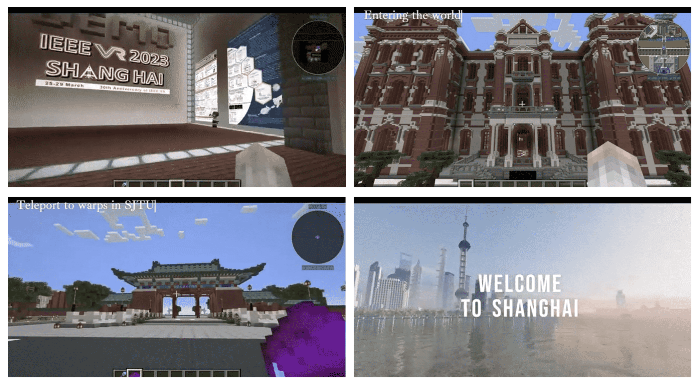
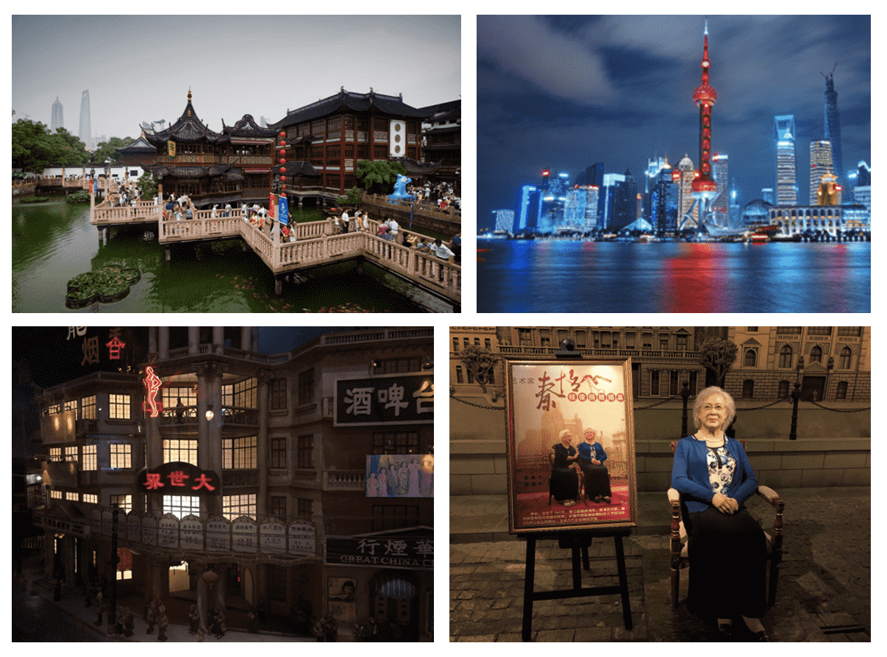

    <!-- 

        你好，欢迎来到中国，上海
    
 -->
    

        <strong>Hello and welcome to Shanghai, China!</strong>
    

    <table class="styled-table">
        <tr>
            <th>
                Social Events
            </th>
            <th>
                Time Schedule
            </th>
        </tr>
        <tr>
            <td>
                <a href="#industry-lab-tour">Industry / Lab Tour</a>
            </td>
            <td>
                Sunday, March 26, 2023
            </td>
        </tr>
        <tr>
            <td>
                <a href="#industry-forum">Industry Forum</a>
            </td>
            <td>
                Monday, March 27, 2023 – Tuesday, March 28, 2023
            </td>
        </tr>
        <tr>
            <td>
                <a href="#reception">Reception: Cruise on The Huangpu River</a>
            </td>
            <td>
                Monday, March 27, 2023
            </td>
        </tr>
        <tr>
            <td>
                <a href="#banquet">Banquet at Shangri-La</a>
            </td>
            <td>
                Tuesday, March 28, 2023
            </td>
        </tr>
        <tr>
            <td>
                <a href="#recruitment">Student Recruitment</a>
            </td>
            <td>
                Tuesday, March 28, 2023
            </td>
        </tr>
        <tr>
            <td>
                <a href="#online-activities">Online Activities</a>
            </td>
            <td>
                Monday, March 27, 2023 – Tuesday, March 28, 2023
            </td>
        </tr>
        <tr>
            <td>
                 <a href="#tour">One-day Tour in Shanghai</a>
            </td>
            <td>
                Thurday, March 30, 2023
            </td>
        </tr>
    </table>
    <h2 id="industry-lab-tour">
        Industry/Lab Tour
    </h2>
    

        School of Information Science and Technology, ShanghaiTech University
    

    

        At the SIST of ShanghaiTech University, participants can visit the MARS Lab (Multidisciplinary Artificial Reality Studio) and experience a series of VR/AR research facilities. MARS Lab will highlight leading-edge VR and visualization research through various top-tier light-field stages and captured domes for physically-based 4D asset reproduction. It will also demonstrate a series of fascinating applications, i.e., the digital twins for smart cities, hyper-real human generation, VR/AR experiences of dynamic neural radiance fields, immersive holographic interactions, etc.
    

    
    <!-- 
    
    
     -->
    <h2 id="industry-forum">
        Industry Forum
    </h2>
    

        This industry forum aims to explore and discuss the latest advancements regarding the metaverse in industries such as production, education, intelligent manufacturing, and cultural tourism. During the event, presenters and panelists will provide and exchange information on key technologies and business innovations related to the development of the metaverse, such as its ecology, supporting technologies, terminal applications, economic systems, and development deductions. Furthermore, discussions will focus on the practical application of relevant technologies, products, and scenarios, with case studies of successful applications and deployments. By bringing together experts in the field, this industry forum aims to encourage the adoption of these technologies and offer more value to the community.
    

    
    <h2 id="reception">
        Reception: Cruise on The Huangpu River
    </h2>
    

        The IEEE VR 2023 reception will take place aboard the traditional Chinese-style boat on the Huangpu River in Shanghai. This reception will celebrate the remarkable and splendid achievements of the 30th anniversary of IEEE VR with the most advanced researchers, scientists, artists, and entrepreneurs, ensuring that attendees will never be disappointed with their choice.
    

    

       Cruising the Huangpu River allows attendees to enjoy a magnificent nightscape with the city's most famous skyscrapers. At the reception, attendees can meet research partners with similar interests and discuss state-of-the-art topics for academic interactions.
    

    
    <h2 id="banquet">
        Banquet at Shangri-La
    </h2>
    

        We will host a banquet for all in-person attendees at the Shangri-La Hotel. The banquet will offer a unique experience of traditional Chinese cuisine. During the banquet, we will have a VGTC award announcement and a keynote, creating a celebratory atmosphere where attendees can share in honor of academic achievement and discuss the past, present, and future of VR technology.
    

    
    <!-- 

        

            
            
        

        

            
            
        

    
 -->
    <h2 id="recruitment">
        Student Recruitment
    </h2>
    

       This event aims to facilitate student employment and enterprise recruitment through various options, such as communication and integration across enterprises and on-site networking, which provides an excellent platform for students and high-quality employees for companies.
    

    <h2 id="online-activities">
        Online Activities
    </h2>
    

       The conference will adopt a hybrid mode, combining online and on-site participation. Those who cannot attend the events in person will be able to interact via a dedicated Slack channel and a particular Minecraft platform, where we have created a replica of Shanghai Jiao Tong University to allow an online experience of the university on the 30th anniversary of the IEEE VR Conference. We will provide further details about online participation in advance of the conference. 
    

    
    <!--  -->
    <h2 id="tour">
        One-day Tour in Shanghai
    </h2>
    

    Participants can join in a one-day exploration of Shanghai, which will take them to some of the city's most iconic sights, including Yuyuan Garden, the Oriental Pearl Radio and Television Tower, and the Shanghai Municipal History Museum. 
    

    <!-- 

    Explore the culture of Shanghai's Old City and take a stroll through the Yuyuan Garden. Step back in time and discover the traditional goods and services of the City God Temper of Shanghai. From time-honored Chinese brands such as Wang Dalong and Liyun Pavilion to unique specialty shops like chopsticks and walking stick vendors, this area has something for everyone. Experience the charm of Shanghai's past and present in this one-of-a-kind destination.
    
 -->
    <!--  -->
    <!-- 

    Experience the beauty and culture of Shanghai by visiting the Oriental Pearl Radio and Television Tower. Climb to the observation deck of the iconic tower and take in the breathtaking panoramic views of the Huangpu River. Standing at 468 meters, it is one of the first National AAAAA Level Scenic Spots in China and offers a variety of experiences, from the space capsules to the revolving restaurant, exhibition halls of Shanghai's urban history and development, and more.
    
 -->
    <!--  -->
    <!-- 

    Shanghai Municipal History Museum is in the Oriental Pearl Radio and TV Tower, which is an image display reflecting the changes of Shanghai's modern history. From the six themed exhibition sections, such as "Style and Features in the Town" and "Past Footsteps in Shanghai," visitors can explore the development of Shanghai through more than 80 scenic spots, hundreds of historical relics, and 117 life-size wax figures. Marvel at the nearly 1000 small wax figures and clay figurines, as well as the thousand pieces of precious cultural relics, which offer insight into the folk customs of Old Shanghai.
    
 -->
    
    <!--  -->

